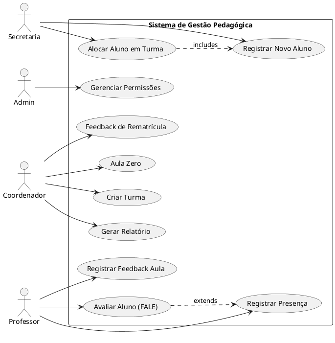
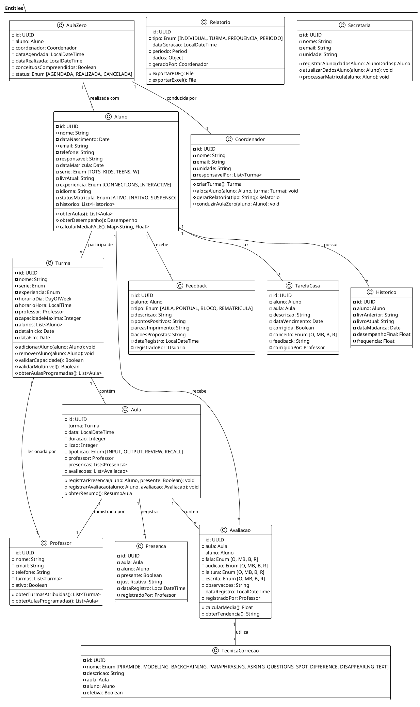
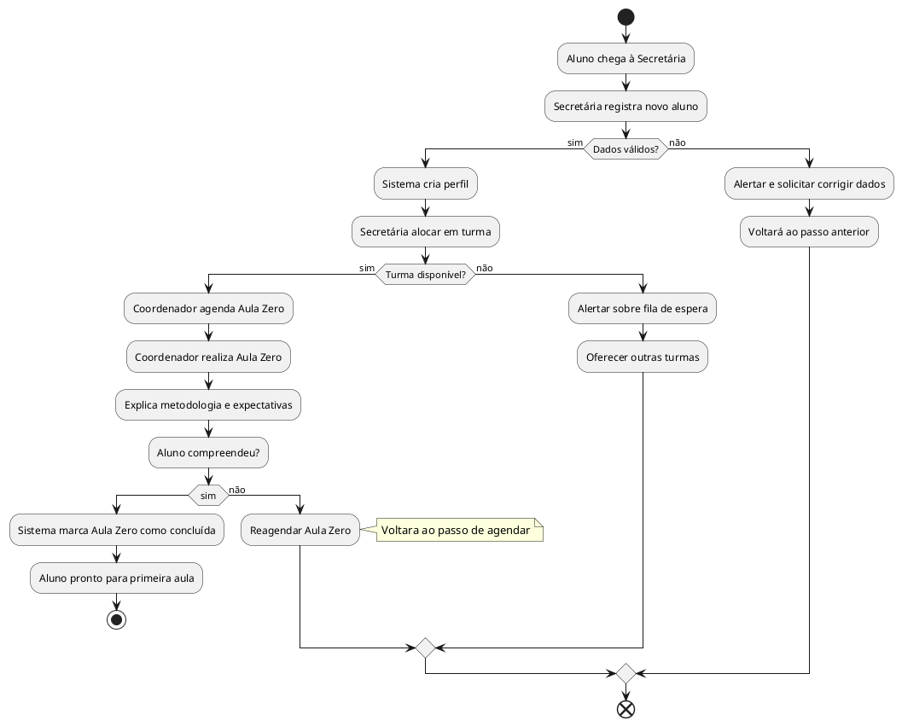
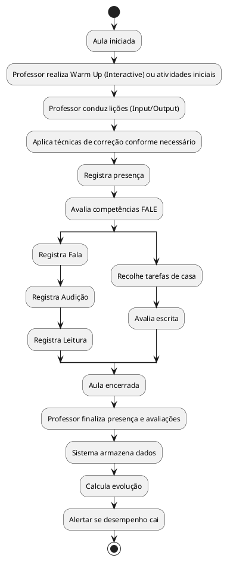
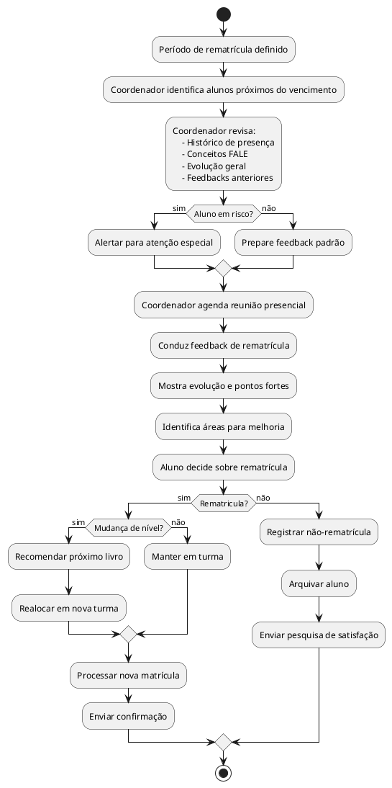
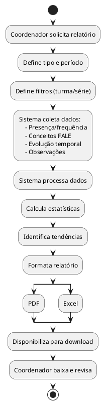

# Sistema de Gestão Pedagógica Wizard by Pearson
## Documentação Técnica Completa para Desenvolvimento

**Versão:** 1.0  
**Data:** Novembro 2025  
**Stack Tecnológico:** Vite + React + Tailwind CSS  
**Objetivo:** Sistema web para gerenciamento de alunos, professores, coordenadores e secretariado/comercial

---

## Índice
1. [Visão Geral do Sistema](#visão-geral-do-sistema)
2. [Análise do Contexto Wizard](#análise-do-contexto-wizard)
3. [Identificação de Atores](#identificação-de-atores)
4. [Levantamento de Requisitos](#levantamento-de-requisitos)
5. [Diagramas C4](#diagramas-c4)
6. [Casos de Uso](#casos-de-uso)
7. [Diagrama de Classes](#diagrama-de-classes)
8. [Fluxos de Processos](#fluxos-de-processos)
9. [Estrutura de Banco de Dados](#estrutura-de-banco-de-dados)
10. [Arquitetura Técnica](#arquitetura-técnica)
11. [Roadmap de Desenvolvimento](#roadmap-de-desenvolvimento)

---

## 1. Visão Geral do Sistema

### Objetivo Principal
Criar uma plataforma centralizada para gerenciar e acompanhar o aprendizado de alunos nas experiências pedagógicas da Wizard by Pearson, com foco em:

- **Acompanhamento Pedagógico**: Monitorar progresso, desempenho e evolução dos alunos
- **Gestão de Turmas**: Controlar distribuição de alunos e alocação em diferentes níveis
- **Avaliação Formativa**: Registrar conceitos (O, MB, B, R) baseados nas 4 habilidades (FALE)
- **Gestão Administrativa**: Controlar matrículas, rematrículas, presença e documentos
- **Relatórios e Análises**: Gerar insights sobre performance individual e de grupo

### Escopo
- **In Scope**: 
  - Gestão completa de alunos (perfil, nível, histórico)
  - Acompanhamento de aulas (presença, desempenho por aula)
  - Avaliação formativa com parâmetros FALE
  - Turmas (Connections e Interactive, multinível/multisérie)
  - Feedback de rematrícula e aula zero
  - Relatórios pedagógicos
  - Gestão de materiais didáticos

- **Out Scope**:
  - Plataforma de aprendizado online (Wiz.me, Wiz.tab)
  - Sistema de pagamentos
  - Videoaulas ou conferências
  - Gerenciamento de RH para professores

---

## 2. Análise do Contexto Wizard

### Estrutura Pedagógica

#### 2.1 Experiências de Aprendizado

**Experience Connections**
- Sala de aula tradicional
- Todos os alunos no mesmo momento
- Professor conduz o ritmo
- Máximo de alunos por turma: 6-16 (depende da série)
- Lições: Input, Output, Review

**Experience Interactive**
- Blended Learning (presencial + digital)
- Multinível (mas não multisérie)
- Máximo 8-10 alunos
- 5 passos obrigatórios:
  1. Warm up
  2. Self-Learning (Wiz.tab)
  3. Teacher's Support
  4. Peer Work
  5. Closing

#### 2.2 Séries e Públicos

| Série | Faixa Etária | Módulos | Tipo |
|-------|-------------|---------|------|
| WizKids - Tots | 3-7 anos | Tots 2, 4, 6; Little Kids 2, 4 | Crianças |
| WizKids - Kids | 8-11 anos | Kids 2, 4, NG | Crianças |
| Teens | 11-14 anos | Teens 2, 4, 6, 8 | Adolescentes |
| W | 15+ anos | W2-W12 | Adultos |
| Idiomas | 15+ anos | Espanhol, Francês, etc. | Adultos |

#### 2.3 Parâmetros de Avaliação (FALE)

**Conceitos:**
- **O (Ótimo)**: ≥90% de acerto
- **MB (Muito Bom)**: 75-89% de acerto
- **B (Bom)**: 60-74% de acerto
- **R (Regular)**: <60% de acerto

**Habilidades:**
- **F (Fala)**: Comunicação verbal - estruturas, vocabulário, pronúncia
- **A (Audição)**: Compreensão auditiva
- **L (Leitura)**: Compreensão de leitura
- **E (Escrita)**: Ortografia, gramática, estrutura, expressão

#### 2.4 Técnicas de Correção

- **Pirâmide**: Revisar estruturas
- **Modeling**: Corrigir pronúncia
- **Backchaining**: Memorização de frases longas
- **Paraphrasing**: Checagem de compreensão
- **Asking Questions**: Validar entendimento
- **Spot the Difference**: Mostrar diferenças estruturais
- **Disappearing Text Technique**: Reforço de memorização

---

## 3. Identificação de Atores

### Atores do Sistema

> **Nota Importante**: Os alunos NÃO são atores do sistema, mas **assets** (ativos). Eles são observados e gerenciados, mas não interagem diretamente com a plataforma.

#### 3.1 Secretária/Comercial (Recepcionist)
**Responsabilidades:**
- Registrar novos alunos
- Gerenciar matrículas
- Controlar dados de contato e documentos
- Processar rematrículas
- Gerar relatórios administrativos
- Controlar frequência administrativa (listas de presença)

#### 3.2 Coordenador Pedagógico (Pedagogical Coordinator)
**Responsabilidades:**
- Criar e gerenciar turmas
- Alocar alunos em turmas
- Avaliar nivelamento (para Teens+)
- Conduzir Aula Zero
- Monitorar performance dos professores
- Gerar relatórios de desempenho
- Feedback de rematrícula
- Análise de tendências

#### 3.3 Professor (Teacher)
**Responsabilidades:**
- Registrar presença em aulas
- Avaliar desempenho individual (FALE)
- Preencher Ficha de Frequência
- Inserir feedback de aulas
- Registrar tarefas de casa
- Monitorar evolução do aluno
- Documentar observações pedagógicas

#### 3.4 Administrador do Sistema (System Admin)
**Responsabilidades:**
- Gerenciar permissões de acesso
- Configurar estrutura (unidades, salas, horários)
- Manutenção do sistema
- Backups e segurança
- Auditar alterações

---

## 4. Levantamento de Requisitos

### 4.1 Requisitos Funcionais

#### RF1: Gestão de Alunos
- **RF1.1**: Criar perfil de aluno (nome, idade, série, experiência, idioma)
- **RF1.2**: Atualizar dados de aluno
- **RF1.3**: Visualizar histórico completo do aluno
- **RF1.4**: Registrar nível/livro atual
- **RF1.5**: Rastrear progressão entre níveis
- **RF1.6**: Vincular aluno a turma

#### RF2: Gestão de Turmas
- **RF2.1**: Criar turma (Connections ou Interactive)
- **RF2.2**: Configurar parâmetros (série, experiência, horário, professor)
- **RF2.3**: Alocar alunos em turma
- **RF2.4**: Remover aluno de turma
- **RF2.5**: Visualizar lista de alunos por turma
- **RF2.6**: Multinível: suportar diferentes níveis na mesma turma (Interactive)
- **RF2.7**: Multisérie: NÃO permitir mistura de séries na mesma turma
- **RF2.8**: Respeitar máximos de alunos por turma

#### RF3: Registrar Presença
- **RF3.1**: Professor marca presença/ausência por aula
- **RF3.2**: Visualizar estatísticas de frequência
- **RF3.3**: Gerar alertas de absentismo
- **RF3.4**: Registrar justificativas de faltas

#### RF4: Avaliação Formativa (FALE)
- **RF4.1**: Registrar conceitos (O, MB, B, R) para cada habilidade
- **RF4.2**: Avaliar Fala (Comunicação Verbal)
- **RF4.3**: Avaliar Audição (Compreensão Auditiva)
- **RF4.4**: Avaliar Leitura (Compreensão de Leitura)
- **RF4.5**: Avaliar Escrita (Ortografia, Gramática, Estrutura, Expressão)
- **RF4.6**: Histórico de avaliações por aluno
- **RF4.7**: Comparar evolução ao longo do tempo

#### RF5: Feedback
- **RF5.1**: Feedback aula a aula
- **RF5.2**: Feedback pontual (comportamento, engajamento)
- **RF5.3**: Feedback de bloco de lições (após review)
- **RF5.4**: Feedback de rematrícula
- **RF5.5**: Registrar feedback individual
- **RF5.6**: Visualizar histórico de feedbacks

#### RF6: Aula Zero
- **RF6.1**: Marcar Aula Zero para novo aluno
- **RF6.2**: Registrar conclusão de Aula Zero
- **RF6.3**: Avaliar compreensão de diretrizes

#### RF7: Relatórios
- **RF7.1**: Relatório individual de desempenho
- **RF7.2**: Relatório de turma
- **RF7.3**: Relatório de frequência
- **RF7.4**: Relatório de progresso por período
- **RF7.5**: Relatório de alunos em risco (absentismo/baixo desempenho)
- **RF7.6**: Exportar relatórios (PDF, Excel)

#### RF8: Materiais Didáticos
- **RF8.1**: Registrar livro/módulo de aluno
- **RF8.2**: Rastrear lições completadas
- **RF8.3**: Indicar Extra Activities para alunos com dificuldades
- **RF8.4**: Registrar tarefas de casa

#### RF9: Rematrícula
- **RF9.1**: Preparar processo de rematrícula
- **RF9.2**: Revisar desempenho e frequência do aluno
- **RF9.3**: Gerar recomendação de próximo nível
- **RF9.4**: Registrar decisão de rematrícula

#### RF10: Técnicas de Correção
- **RF10.1**: Registrar qual técnica de correção foi utilizada
- **RF10.2**: Indicador de melhoria após correção
- **RF10.3**: Histórico de técnicas por aluno

### 4.2 Requisitos Não-Funcionais

#### RNF1: Performance
- Sistema deve carregar em menos de 2 segundos
- Suportar 500+ usuários simultâneos
- Resposta de API < 200ms

#### RNF2: Segurança
- Autenticação por login/senha
- Permissões baseadas em roles
- Dados criptografados em trânsito (HTTPS)
- Logs de auditoria para alterações

#### RNF3: Disponibilidade
- Uptime de 99.5%
- Backup diário de dados
- Recuperação de desastres em 4 horas

#### RNF4: Usabilidade
- Interface intuitiva
- Responsiva para desktop, tablet, mobile
- Acessibilidade WCAG 2.1 AA

#### RNF5: Escalabilidade
- Arquitetura modular
- Preparada para crescimento de dados
- Suportar múltiplas unidades

#### RNF6: Manutenibilidade
- Código documentado
- Testes unitários (>80% cobertura)
- Fácil deploy

---

## 5. Diagramas C4

### 5.1 Context Diagram (Nível 1)

```plantuml
@startuml
!include https://raw.githubusercontent.com/RicardoNiepel/C4-PlantUML/master/C4_Context.puml

SHOW_PERSON_OUTLINE()

Person(secretaria, "Secretária/Comercial", "Gerencia matrículas e dados administrativos")
Person(coordenador, "Coordenador Pedagógico", "Acompanha desempenho pedagógico")
Person(professor, "Professor", "Registra avaliações e presença")

System(wizard, "Sistema de Gestão Pedagógica Wizard", "Plataforma centralizada para acompanhamento de alunos")

System_Ext(wizme, "Wiz.me", "Plataforma de self-study online")
System_Ext(wiztab, "Wiz.tab", "Tablet com material didático")
System_Ext(email, "Sistema de Email", "Notificações e comunicação")

Rel(secretaria, wizard, "Gerencia matrículas e alunos")
Rel(coordenador, wizard, "Acompanha performance e cria turmas")
Rel(professor, wizard, "Registra presença e avaliações")

Rel(wizard, wizme, "Sincroniza dados de progresso")
Rel(wizard, wiztab, "Consulta material didático")
Rel(wizard, email, "Envia notificações")

@enduml
```

### 5.2 Container Diagram (Nível 2)

```plantuml
@startuml
!include https://raw.githubusercontent.com/RicardoNiepel/C4-PlantUML/master/C4_Container.puml

Person(secretaria, "Secretária", "")
Person(coordenador, "Coordenador", "")
Person(professor, "Professor", "")

System_Boundary(wizard, "Sistema de Gestão Pedagógica") {
    Container(web, "Aplicação Web", "Vite + React + Tailwind", "Interface para acesso ao sistema")
    Container(api, "API REST", "Node.js/Express", "Lógica de negócio e processamento")
    Container(auth, "Serviço de Autenticação", "JWT", "Gerencia login e permissões")
    Container(db, "Banco de Dados", "PostgreSQL", "Armazena dados do sistema")
    Container(cache, "Cache", "Redis", "Melhora performance")
    Container(reports, "Motor de Relatórios", "Node.js", "Gera PDFs e planilhas")
}

Container_Ext(wizme, "Wiz.me", "REST API", "")
Container_Ext(email, "Email Service", "SMTP", "")

Rel(secretaria, web, "Utiliza")
Rel(coordenador, web, "Utiliza")
Rel(professor, web, "Utiliza")

Rel(web, api, "Faz requisições HTTPS")
Rel(api, auth, "Valida acesso")
Rel(api, db, "Lê/Escreve")
Rel(api, cache, "Cache de sessão")
Rel(api, reports, "Gera relatórios")
Rel(api, wizme, "Sincroniza dados")
Rel(api, email, "Envia notificações")

@enduml
```

### 5.3 Component Diagram (Nível 3)

```plantuml
@startuml
!include https://raw.githubusercontent.com/RicardoNiepel/C4-PlantUML/master/C4_Component.puml

Container_Boundary(frontend, "Frontend") {
    Component(ui_alunos, "Módulo Alunos", "React Component", "Gerenciar perfis de alunos")
    Component(ui_turmas, "Módulo Turmas", "React Component", "Criar e gerenciar turmas")
    Component(ui_avaliacao, "Módulo Avaliação", "React Component", "Registrar FALE")
    Component(ui_presenca, "Módulo Presença", "React Component", "Marcar presença")
    Component(ui_relatorios, "Módulo Relatórios", "React Component", "Visualizar relatórios")
    Component(ui_feedback, "Módulo Feedback", "React Component", "Registrar feedback")
}

Container_Boundary(backend, "Backend") {
    Component(ctrl_alunos, "Controller Alunos", "Express", "Handle requisições de alunos")
    Component(ctrl_turmas, "Controller Turmas", "Express", "Handle requisições de turmas")
    Component(ctrl_avaliacao, "Controller Avaliação", "Express", "Handle requisições de avaliação")
    Component(svc_alunos, "Service Alunos", "Business Logic", "Lógica de alunos")
    Component(svc_turmas, "Service Turmas", "Business Logic", "Lógica de turmas")
    Component(svc_relatorios, "Service Relatórios", "Business Logic", "Gera insights")
    Component(repo_alunos, "Repository Alunos", "Data Access", "Acesso a BD de alunos")
    Component(repo_turmas, "Repository Turmas", "Data Access", "Acesso a BD de turmas")
    Component(repo_avaliacoes, "Repository Avaliações", "Data Access", "Acesso a BD de avaliações")
}

Rel(ui_alunos, ctrl_alunos, "")
Rel(ui_turmas, ctrl_turmas, "")
Rel(ui_avaliacao, ctrl_avaliacao, "")

Rel(ctrl_alunos, svc_alunos, "")
Rel(ctrl_turmas, svc_turmas, "")
Rel(ctrl_avaliacao, svc_relatorios, "")

Rel(svc_alunos, repo_alunos, "")
Rel(svc_turmas, repo_turmas, "")
Rel(svc_relatorios, repo_avaliacoes, "")

@enduml
```

---

## 6. Casos de Uso

### 6.1 Diagrama de Casos de Uso



### 6.2 Descrição Detalhada dos Casos de Uso

#### UC1: Registrar Novo Aluno

| Campo | Descrição |
|-------|-----------|
| **Ator Primário** | Secretária/Comercial |
| **Pré-condições** | - |
| **Fluxo Principal** | 1. Secretária clica em "Novo Aluno" 2. Preenche formulário (nome, data nascimento, responsável, contato) 3. Sistema valida dados 4. Sistema cria perfil 5. Sistema retorna ID do aluno |
| **Fluxo Alternativo** | Se email duplicado: Alertar e pedir confirmação |
| **Pós-condições** | Aluno registrado no sistema, pronto para matrícula |

#### UC2: Criar Turma

| Campo | Descrição |
|-------|-----------|
| **Ator Primário** | Coordenador Pedagógico |
| **Pré-condições** | Existe professor disponível |
| **Fluxo Principal** | 1. Coordenador clica em "Nova Turma" 2. Seleciona série, experiência (Connections/Interactive), horário 3. Seleciona professor responsável 4. Define capacidade máxima 5. Sistema valida configuração 6. Sistema cria turma |
| **Validações** | - Máximo de alunos por tipo de experiência - Não misturar séries em Interactive - Horário sem conflitos |
| **Pós-condições** | Turma criada, pronta para receber alunos |

#### UC3: Alocar Aluno em Turma

| Campo | Descrição |
|-------|-----------|
| **Ator Primário** | Secretária/Comercial |
| **Pré-condições** | Aluno registrado, Turma criada |
| **Fluxo Principal** | 1. Secretária busca aluno 2. Seleciona turma 3. Sistema valida compatibilidade (série, nível) 4. Sistema valida capacidade 5. Sistema aloca aluno 6. Envia notificação ao professor |
| **Validações** | - Aluno não pode estar em 2 turmas simultâneas - Respeitar máximos - Validar série vs turma |
| **Pós-condições** | Aluno alocado em turma, professor notificado |

#### UC4: Registrar Presença

| Campo | Descrição |
|-------|-----------|
| **Ator Primário** | Professor |
| **Pré-condições** | Aula agendada, alunos alocados |
| **Fluxo Principal** | 1. Professor abre turma do dia 2. Visualiza lista de alunos 3. Marca presentes/ausentes 4. Sistema registra com timestamp 5. Professor salva |
| **Alternativas** | - Justificar falta - Registrar falta com motivo |
| **Pós-condições** | Presença registrada, estatísticas atualizadas |

#### UC5: Avaliar Aluno (FALE)

| Campo | Descrição |
|-------|-----------|
| **Ator Primário** | Professor |
| **Pré-condições** | Aula realizada, presença marcada |
| **Fluxo Principal** | 1. Professor abre formulário de avaliação 2. Seleciona aluno 3. Avalia Fala (O/MB/B/R) 4. Avalia Audição (O/MB/B/R) 5. Avalia Leitura (O/MB/B/R) 6. Avalia Escrita (O/MB/B/R) 7. Adiciona observação (opcional) 8. Sistema salva com data/hora |
| **Observações** | - Fala, Audição e Leitura avaliadas por aula - Escrita avaliada após tarefa de casa |
| **Pós-condições** | Conceitos registrados, histórico atualizado |

#### UC6: Gerar Relatório

| Campo | Descrição |
|-------|-----------|
| **Ator Primário** | Coordenador Pedagógico |
| **Tipos** | - Individual (aluno) - Turma - Frequência - Período |
| **Fluxo Principal** | 1. Coordenador seleciona tipo de relatório 2. Define período 3. Seleciona filtros (turma, série, etc.) 4. Sistema processa dados 5. Sistema gera PDF/Excel 6. Disponibiliza download |
| **Dados** | - Evolução FALE - Frequência - Observações - Tendências |
| **Pós-condições** | Relatório gerado e disponível para download |

#### UC7: Feedback de Rematrícula

| Campo | Descrição |
|-------|-----------|
| **Ator Primário** | Coordenador Pedagógico |
| **Pré-condições** | Período de rematrícula, aluno ativo |
| **Fluxo Principal** | 1. Coordenador busca aluno 2. Revisa histórico completo (desempenho, frequência) 3. Agenda reunião de feedback 4. Realiza reunião (presencial) 5. Registra decisão 6. Sistema recomenda próximo nível 7. Registra conclusão |
| **Dados Analisados** | - Presença/Absentismo - Conceitos FALE - Evolução ao longo do período - Feedbacks anteriores |
| **Pós-condições** | Feedback registrado, aluno rematriculado ou não |

#### UC8: Registrar Feedback Aula

| Campo | Descrição |
|-------|-----------|
| **Ator Primário** | Professor |
| **Pré-condições** | Aula concluída |
| **Fluxo Principal** | 1. Professor abre feedback individual 2. Seleciona aluno 3. Registra pontos positivos 4. Registra áreas de melhoria 5. Adiciona ações sugeridas 6. Sistema salva |
| **Quando Usar** | - Após comportamento específico - Ao notar queda no engajamento - Ao atingir objetivo importante |
| **Pós-condições** | Feedback registrado no histórico do aluno |

#### UC9: Aula Zero

| Campo | Descrição |
|-------|-----------|
| **Ator Primário** | Coordenador Pedagógico |
| **Pré-condições** | Novo aluno alocado |
| **Fluxo Principal** | 1. Coordenador agenda Aula Zero 2. Conduz aula (metodologia, expectativas, direitos/deveres) 3. Valida compreensão de diretrizes 4. Sistema registra conclusão 5. Aluno preparado para entrar em turma |
| **Pós-condições** | Aula Zero realizada, aluno pronto para primeira aula |

---

## 7. Diagrama de Classes



---

## 8. Fluxos de Processos

### 8.1 Fluxo de Matricula de Novo Aluno



### 8.2 Fluxo de Avaliação Formativa em Aula



### 8.3 Fluxo de Rematrícula



### 8.4 Fluxo de Geração de Relatório



---

## 9. Estrutura de Banco de Dados

### 9.1 Schema de Banco de Dados

```plantuml
@startuml
' Users and Authentication
entity "usuarios" as usuarios {
    * id: UUID <<PK>>
    --
    nome: String
    email: String <<UK>>
    senha_hash: String
    tipo: Enum (PROFESSOR, COORDENADOR, SECRETARIA, ADMIN)
    ativo: Boolean
    data_criacao: Timestamp
    data_atualizacao: Timestamp
}

entity "permissoes" as permissoes {
    * id: UUID <<PK>>
    --
    usuario_id: UUID <<FK>>
    papel: String
    permissao: String
    data_concessao: Timestamp
}

' Core Entities
entity "alunos" as alunos {
    * id: UUID <<PK>>
    --
    nome: String
    data_nascimento: Date
    email: String
    telefone: String
    responsavel: String
    data_matricula: Date
    serie: Enum (TOTS, KIDS, TEENS, W)
    livro_atual: String
    experiencia: Enum (CONNECTIONS, INTERACTIVE)
    idioma: String
    status_matricula: Enum (ATIVO, INATIVO, SUSPENSO)
}

entity "turmas" as turmas {
    * id: UUID <<PK>>
    --
    nome: String
    serie: Enum
    experiencia: Enum
    horario_dia: DayOfWeek
    horario_hora: Time
    professor_id: UUID <<FK>>
    capacidade_maxima: Integer
    data_inicio: Date
    data_fim: Date
    ativa: Boolean
}

entity "alunos_turmas" as alunos_turmas {
    * id: UUID <<PK>>
    --
    aluno_id: UUID <<FK>>
    turma_id: UUID <<FK>>
    data_alocacao: Date
    data_remocao: Date
    motivo_remocao: String
}

entity "aulas" as aulas {
    * id: UUID <<PK>>
    --
    turma_id: UUID <<FK>>
    data: DateTime
    duracao_minutos: Integer
    licao_numero: Integer
    tipo_licao: Enum (INPUT, OUTPUT, REVIEW, RECALL)
    professor_id: UUID <<FK>>
}

' Attendance and Evaluation
entity "presencas" as presencas {
    * id: UUID <<PK>>
    --
    aula_id: UUID <<FK>>
    aluno_id: UUID <<FK>>
    presente: Boolean
    justificativa: String
    data_registro: Timestamp
    registrado_por: UUID <<FK>>
}

entity "avaliacoes" as avaliacoes {
    * id: UUID <<PK>>
    --
    aula_id: UUID <<FK>>
    aluno_id: UUID <<FK>>
    fala: Enum (O, MB, B, R)
    audicao: Enum (O, MB, B, R)
    leitura: Enum (O, MB, B, R)
    escrita: Enum (O, MB, B, R)
    observacoes: Text
    data_registro: Timestamp
    registrado_por: UUID <<FK>>
}

entity "tarefas_casa" as tarefas_casa {
    * id: UUID <<PK>>
    --
    aluno_id: UUID <<FK>>
    aula_id: UUID <<FK>>
    descricao: String
    data_vencimento: Date
    corrigida: Boolean
    conceito: Enum (O, MB, B, R)
    feedback: Text
    corrigida_por: UUID <<FK>>
}

' Feedback and Communication
entity "feedbacks" as feedbacks {
    * id: UUID <<PK>>
    --
    aluno_id: UUID <<FK>>
    tipo: Enum (AULA, PONTUAL, BLOCO, REMATRICULA)
    descricao: Text
    pontos_positivos: Text
    areas_melhoria: Text
    acoes_propostas: Text
    data_registro: Timestamp
    registrado_por: UUID <<FK>>
}

entity "aula_zero" as aula_zero {
    * id: UUID <<PK>>
    --
    aluno_id: UUID <<FK>>
    coordenador_id: UUID <<FK>>
    data_agendada: DateTime
    data_realizada: DateTime
    conceitos_compreendidos: Boolean
    status: Enum (AGENDADA, REALIZADA, CANCELADA)
}

' Corrections and Techniques
entity "tecnicas_correcao" as tecnicas_correcao {
    * id: UUID <<PK>>
    --
    aula_id: UUID <<FK>>
    aluno_id: UUID <<FK>>
    tipo: Enum (PIRAMIDE, MODELING, BACKCHAINING, ...)
    descricao: Text
    efetiva: Boolean
    data_registro: Timestamp
}

' History and Progress
entity "historico_aluno" as historico_aluno {
    * id: UUID <<PK>>
    --
    aluno_id: UUID <<FK>>
    livro_anterior: String
    livro_atual: String
    data_mudanca: Date
    desempenho_final: Float
    frequencia: Float
}

' Reports
entity "relatorios" as relatorios {
    * id: UUID <<PK>>
    --
    tipo: Enum (INDIVIDUAL, TURMA, FREQUENCIA, PERIODO)
    usuario_id: UUID <<FK>>
    periodo_inicio: Date
    periodo_fim: Date
    filtros: JSON
    dados: JSON
    data_geracao: Timestamp
}

' Relationships
usuarios ||--o{ permissoes : "tem"
usuarios ||--o{ presencas : "registra"
usuarios ||--o{ avaliacoes : "registra"
usuarios ||--o{ feedbacks : "registra"
usuarios ||--o{ aula_zero : "conduz"

alunos ||--o{ alunos_turmas : "participa"
turmas ||--o{ alunos_turmas : "recebe"

turmas ||--o{ aulas : "tem"
aulas ||--o{ presencas : "registra"
aulas ||--o{ avaliacoes : "contém"
aulas ||--o{ tarefas_casa : "gera"
aulas ||--o{ tecnicas_correcao : "usa"

alunos ||--o{ presencas : "marca"
alunos ||--o{ avaliacoes : "recebe"
alunos ||--o{ tarefas_casa : "faz"
alunos ||--o{ feedbacks : "recebe"
alunos ||--o{ aula_zero : "participa"
alunos ||--o{ tecnicas_correcao : "recebe"
alunos ||--o{ historico_aluno : "possui"

relatorios }o--|| usuarios : "gerado por"

@enduml
```



### 9.2 Índices Recomendados

```sql
-- Índices para queries frequentes
CREATE INDEX idx_alunos_email ON alunos(email);
CREATE INDEX idx_alunos_serie ON alunos(serie);
CREATE INDEX idx_alunos_status ON alunos(status_matricula);

CREATE INDEX idx_turmas_professor ON turmas(professor_id);
CREATE INDEX idx_turmas_serie ON turmas(serie);
CREATE INDEX idx_turmas_ativa ON turmas(ativa);

CREATE INDEX idx_alunos_turmas_aluno ON alunos_turmas(aluno_id);
CREATE INDEX idx_alunos_turmas_turma ON alunos_turmas(turma_id);

CREATE INDEX idx_aulas_turma ON aulas(turma_id);
CREATE INDEX idx_aulas_data ON aulas(data);

CREATE INDEX idx_presencas_aula ON presencas(aula_id);
CREATE INDEX idx_presencas_aluno ON presencas(aluno_id);
CREATE INDEX idx_presencas_data ON presencas(data_registro);

CREATE INDEX idx_avaliacoes_aluno ON avaliacoes(aluno_id);
CREATE INDEX idx_avaliacoes_aula ON avaliacoes(aula_id);
CREATE INDEX idx_avaliacoes_data ON avaliacoes(data_registro);

CREATE INDEX idx_feedbacks_aluno ON feedbacks(aluno_id);
CREATE INDEX idx_feedbacks_tipo ON feedbacks(tipo);

CREATE INDEX idx_tarefas_aluno ON tarefas_casa(aluno_id);
CREATE INDEX idx_tarefas_vencimento ON tarefas_casa(data_vencimento);

CREATE INDEX idx_aula_zero_aluno ON aula_zero(aluno_id);
CREATE INDEX idx_aula_zero_status ON aula_zero(status);
```

---

## 10. Arquitetura Técnica

### 10.1 Arquitetura da Solução

```
wizard-gestao-pedagogica/
├── frontend/                          # Aplicação React
│   ├── src/
│   │   ├── components/
│   │   │   ├── alunos/
│   │   │   │   ├── ListaAlunos.jsx
│   │   │   │   ├── FormAluno.jsx
│   │   │   │   └── DetalheAluno.jsx
│   │   │   ├── turmas/
│   │   │   │   ├── ListaTurmas.jsx
│   │   │   │   ├── FormTurma.jsx
│   │   │   │   └── AlocacaoAluno.jsx
│   │   │   ├── avaliacoes/
│   │   │   │   ├── FormAvaliacao.jsx
│   │   │   │   ├── HistoricoAvaliacoes.jsx
│   │   │   │   └── GraficoDesempenho.jsx
│   │   │   ├── presenca/
│   │   │   │   ├── RegistroPresenca.jsx
│   │   │   │   └── RelatorioFrequencia.jsx
│   │   │   ├── feedback/
│   │   │   │   ├── FormFeedback.jsx
│   │   │   │   └── ListaFeedbacks.jsx
│   │   │   ├── relatorios/
│   │   │   │   ├── GeradorRelatorio.jsx
│   │   │   │   └── ExibidorRelatorio.jsx
│   │   │   ├── layout/
│   │   │   │   ├── Sidebar.jsx
│   │   │   │   ├── Header.jsx
│   │   │   │   └── Layout.jsx
│   │   │   └── common/
│   │   │       ├── Button.jsx
│   │   │       ├── Modal.jsx
│   │   │       └── Table.jsx
│   │   ├── pages/
│   │   │   ├── Dashboard.jsx
│   │   │   ├── Alunos.jsx
│   │   │   ├── Turmas.jsx
│   │   │   ├── Avaliacoes.jsx
│   │   │   └── Relatorios.jsx
│   │   ├── services/
│   │   │   ├── api.js
│   │   │   ├── alunoService.js
│   │   │   ├── turmaService.js
│   │   │   ├── avaliacaoService.js
│   │   │   └── relatorioService.js
│   │   ├── store/
│   │   │   ├── reducers/
│   │   │   └── actions/
│   │   ├── hooks/
│   │   │   └── useAuth.js
│   │   ├── utils/
│   │   │   ├── validators.js
│   │   │   └── formatters.js
│   │   ├── App.jsx
│   │   └── main.jsx
│   ├── tailwind.config.js
│   ├── vite.config.js
│   └── package.json
│
├── backend/                           # API Node.js
│   ├── src/
│   │   ├── controllers/
│   │   │   ├── alunoController.js
│   │   │   ├── turmaController.js
│   │   │   ├── aulaController.js
│   │   │   ├── presencaController.js
│   │   │   ├── avaliacaoController.js
│   │   │   ├── feedbackController.js
│   │   │   ├── relatorioController.js
│   │   │   └── authController.js
│   │   ├── services/
│   │   │   ├── alunoService.js
│   │   │   ├── turmaService.js
│   │   │   ├── avaliacaoService.js
│   │   │   ├── relatorioService.js
│   │   │   └── emailService.js
│   │   ├── repositories/
│   │   │   ├── alunoRepository.js
│   │   │   ├── turmaRepository.js
│   │   │   ├── aulaRepository.js
│   │   │   ├── avaliacaoRepository.js
│   │   │   └── feedbackRepository.js
│   │   ├── models/
│   │   │   ├── Aluno.js
│   │   │   ├── Turma.js
│   │   │   ├── Aula.js
│   │   │   ├── Avaliacao.js
│   │   │   └── Feedback.js
│   │   ├── routes/
│   │   │   ├── alunos.js
│   │   │   ├── turmas.js
│   │   │   ├── aulas.js
│   │   │   ├── avaliacoes.js
│   │   │   ├── relatorios.js
│   │   │   ├── feedback.js
│   │   │   └── auth.js
│   │   ├── middleware/
│   │   │   ├── authMiddleware.js
│   │   │   ├── errorHandler.js
│   │   │   └── logger.js
│   │   ├── utils/
│   │   │   ├── validators.js
│   │   │   └── helpers.js
│   │   ├── database/
│   │   │   ├── connection.js
│   │   │   ├── migrations/
│   │   │   └── seeds/
│   │   ├── config/
│   │   │   ├── database.js
│   │   │   ├── env.js
│   │   │   └── constants.js
│   │   └── app.js
│   ├── .env
│   ├── package.json
│   └── server.js
│
├── database/                          # Scripts de BD
│   ├── schema.sql
│   ├── indexes.sql
│   ├── migrations/
│   └── seeds/
│
└── docs/                              # Documentação
    ├── API.md
    ├── DATABASE.md
    └── SETUP.md
```

### 10.2 Stack Tecnológico

**Frontend:**
- Vite (build tool)
- React 18+
- Tailwind CSS (styling)
- Axios (HTTP client)
- React Router v6
- Zustand ou Redux (state management)
- React Hook Form (formulários)
- Chart.js ou Recharts (gráficos)
- date-fns (manipulação de datas)

**Backend:**
- Node.js 18+
- Express.js (framework)
- PostgreSQL (banco de dados)
- Redis (cache)
- JWT (autenticação)
- Sequelize ou TypeORM (ORM)
- Joi (validação)
- Winston (logging)
- Nodemailer (email)
- pdfkit (geração de PDF)
- xlsx (geração de Excel)

**DevOps:**
- Docker
- Docker Compose
- GitHub Actions (CI/CD)
- ESLint + Prettier (code formatting)
- Jest + Supertest (testes)

### 10.3 Padrões de Design

**Frontend:**
- Container/Presentational Components
- Custom Hooks
- Context API para estado global
- Smart/Dumb Components

**Backend:**
- MVC (Model-View-Controller)
- Repository Pattern
- Service Layer
- Dependency Injection
- Factory Pattern

### 10.4 Fluxo de Dados

```
Usuario (navegador)
    ↓
Frontend (React)
    ↓
API REST (Express)
    ↓
Middleware (auth, validação)
    ↓
Controller
    ↓
Service (lógica de negócio)
    ↓
Repository (acesso a dados)
    ↓
PostgreSQL (banco de dados)
```

---

## 11. Roadmap de Desenvolvimento

### Fase 1: MVP (Semanas 1-4)
**Objetivos:** Estabelecer arquitetura base e funcionalidades core

- [ ] Setup inicial (estrutura de projetos, BD, autenticação)
- [ ] CRUD de Alunos
- [ ] CRUD de Turmas
- [ ] Alocação de alunos em turmas
- [ ] Registro de presença
- [ ] UI básica com Tailwind

**Entregáveis:**
- [ ] Banco de dados configurado
- [ ] API REST funcional (50% de endpoints)
- [ ] Interface funcional (dashboard básico)

### Fase 2: Avaliação e Feedback (Semanas 5-8)
**Objetivos:** Implementar sistema de avaliação FALE

- [ ] Formulário de avaliação FALE
- [ ] Histórico de avaliações
- [ ] Cálculo de médias e tendências
- [ ] Registro de feedback
- [ ] Técnicas de correção
- [ ] Gráficos de desempenho

**Entregáveis:**
- [ ] 100% dos endpoints de avaliação
- [ ] UI de avaliações
- [ ] Visualizações de desempenho

### Fase 3: Relatórios e Analytics (Semanas 9-12)
**Objetivos:** Relatórios completos e insights

- [ ] Gerador de relatórios
- [ ] Exportação PDF
- [ ] Exportação Excel
- [ ] Análises por período
- [ ] Alertas de risco
- [ ] Dashboard com KPIs

**Entregáveis:**
- [ ] Módulo de relatórios
- [ ] Sistema de alertas
- [ ] Dashboard analítico

### Fase 4: Workflows Especiais (Semanas 13-16)
**Objetivos:** Aula Zero, Rematrícula, Técnicas

- [ ] Workflow de Aula Zero
- [ ] Workflow de Rematrícula
- [ ] Integração com Wiz.me
- [ ] Sincronização de dados
- [ ] Notificações via email

**Entregáveis:**
- [ ] Workflows completos
- [ ] Integração com plataformas
- [ ] Sistema de notificações

### Fase 5: Testing e Otimização (Semanas 17-20)
**Objetivos:** Qualidade e performance

- [ ] Testes unitários (80%+ cobertura)
- [ ] Testes de integração
- [ ] Testes E2E
- [ ] Otimização de performance
- [ ] Segurança

**Entregáveis:**
- [ ] Suíte de testes completa
- [ ] Relatório de cobertura
- [ ] Otimizações aplicadas

### Fase 6: Deployment (Semanas 21-24)
**Objetivos:** Colocar em produção

- [ ] Containerização Docker
- [ ] CI/CD Pipeline
- [ ] Documentação completa
- [ ] Treinamento de usuários
- [ ] Monitoramento e logs

**Entregáveis:**
- [ ] Sistema em produção
- [ ] Documentação
- [ ] Treinamentos realizados

---

## Apêndice A: Glossário

| Termo | Definição |
|-------|-----------|
| **FALE** | Fala, Audição, Leitura, Escrita - 4 habilidades de avaliação |
| **Connections** | Experiência de classe tradicional com todos os alunos no mesmo ritmo |
| **Interactive** | Experiência de blended learning multinível com 5 passos |
| **Multinível** | Turma com alunos em diferentes níveis/livros |
| **Multisérie** | Turma com alunos de diferentes séries |
| **Input Lesson** | Lição de apresentação de novo conteúdo |
| **Output Lesson** | Lição de prática e contextualização |
| **Review** | Lição de revisão de conteúdo anterior |
| **Ficha de Frequência** | Documento oficial de registro de avaliação |
| **Conceitos** | O (Ótimo), MB (Muito Bom), B (Bom), R (Regular) |

---

## Apêndice B: Referências do Documento Original

O presente sistema foi desenvolvido com base na análise completa do documento **"Booklet de Gestão Pedagógica - Wizard by Pearson"** que abrange:

- Metodologia Wizard (4 métodos base)
- Técnicas de correção (7 técnicas)
- Avaliação formativa
- Experiências Connections e Interactive
- Séries (Tots, Kids, Teens, W)
- Módulos de cada série
- Estrutura de aulas
- Materiais de suporte
- Aula Zero e Rematrícula

---

**Documento preparado para iniciar desenvolvimento**  
**Data:** Novembro 2025  
**Status:** Pronto para desenvolvimento  
**Próximo passo:** Iniciar Fase 1 - MVP
