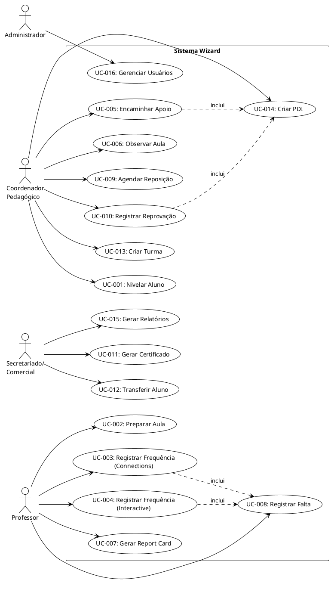
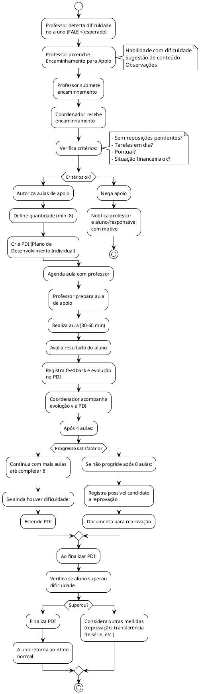
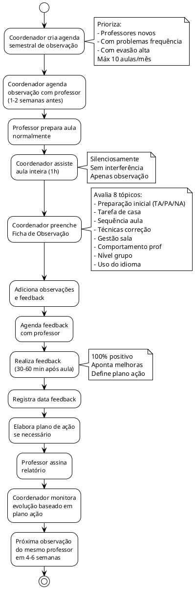
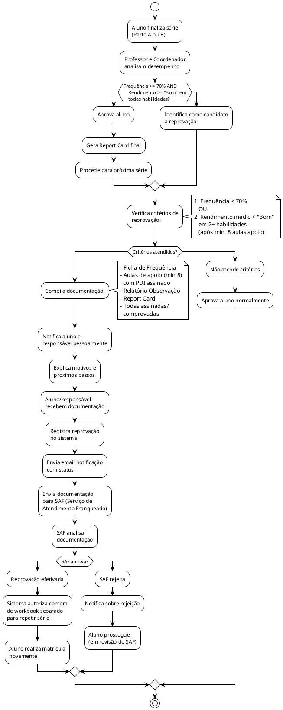

# Sistema de Gestão Administrativa e Pedagógica Wizard
## Documentação Técnica Completa

---

## 📋 Índice

1. [Visão Geral do Sistema](#visão-geral)
2. [Análise de Requisitos](#análise-de-requisitos)
3. [Casos de Uso](#casos-de-uso)
4. [Diagrama C4](#diagrama-c4)
5. [Modelo de Classes](#modelo-de-classes)
6. [Fluxos de Negócio](#fluxos-de-negócio)
7. [Especificações Técnicas](#especificações-técnicas)
8. [Roadmap de Desenvolvimento](#roadmap)

---

## 1. Visão Geral do Sistema {#visão-geral}

### Objetivo
Criar uma plataforma web completa para gerenciar todos os aspectos administrativos e pedagógicos de uma unidade Wizard, incluindo:

- **Gestão de Alunos**: Nivelamento, acompanhamento, performance
- **Gestão Pedagógica**: Frequência, notas, relatórios
- **Gestão de Professores**: Observação de aula, feedback, preparação
- **Gestão Administrativa**: Certificados, transferências, documentação
- **Dashboard e Relatórios**: Análise de dados, KPIs, insights

### Stack Tecnológico
- **Frontend**: React 18+ com Vite
- **Styling**: Tailwind CSS
- **State Management**: Redux Toolkit ou Zustand
- **API**: Backend REST (Node.js/Express recomendado)
- **Banco de Dados**: PostgreSQL ou MongoDB
- **Autenticação**: JWT com Role-Based Access Control (RBAC)

### Atores do Sistema
Os alunos **NÃO** interagem com o sistema. Os atores são:

1. **Coordenador Pedagógico**: Nivelamento, observação de aulas, autorização de apoios
2. **Professor**: Preparação de aula, frequência, avaliação, relatórios
3. **Secretariado/Comercial**: Gestão de contratos, certificados, relatórios financeiros
4. **Administrador**: Gestão de usuários, configurações, backups

---

## 2. Análise de Requisitos {#análise-de-requisitos}

### 2.1 Requisitos Funcionais Principais

#### RF-001: Nivelamento de Alunos
- **Descrição**: Cadastrar alunos e realizar testes de nivelamento
- **Ator Primário**: Coordenador Pedagógico
- **Fluxo**:
  - Registrar novo aluno (nome, idade, e-mail, responsável)
  - Selecionar série (Tots, Kids, Teens, Ws)
  - Registrar desempenho no teste (oral e escrito)
  - Alocar em turma/horário
  - Gerar relatório de nivelamento
- **Dados Necessários**: Nome, DOB, série, desempenho oral/escrito, idioma

#### RF-002: Preparação de Aula
- **Descrição**: Registrar plano de aula e atividades planejadas
- **Ator Primário**: Professor
- **Fluxo**:
  - Selecionar turma e data
  - Informar lições do dia (por aluno)
  - Selecionar atividades (warm-up, main, closing)
  - Adicionar observações
  - Salvar plano
- **Dados Necessários**: Turma, data, alunos, lições, atividades, observações

#### RF-003: Ficha de Frequência - Connections
- **Descrição**: Registrar frequência e avaliação FALE por lição
- **Ator Primário**: Professor
- **Fluxo**:
  - Abrir ficha de frequência da turma
  - Por lição (L1-L30 ou mais):
    - Marcar presença/falta
    - Registrar entrega de homework (X/entregou atrasado)
    - Avaliar FALE (Fala, Audição, Leitura, Escrita)
  - Registrar reposição/aprimoramento
  - Salvar e solicitar visto do coordenador
- **Dados Necessários**: Aluno, presença, homework, avaliação FALE, reposição

#### RF-004: Ficha de Frequência - Interactive
- **Descrição**: Registrar frequência com FEEDBACK personalizado por lição
- **Ator Primário**: Professor
- **Fluxo**:
  - Abrir ficha de frequência (70 aulas + 3 bônus)
  - Por aula:
    - Registrar data planejada/realizada
    - Avaliar FALE com feedback específico:
      - Aspas para pronúncia
      - Sublinhado para estrutura
      - X para alternativas
      - Indicações de review
    - Marcar reposição se necessário
  - Assinatura professor e coordenador
- **Dados Necessários**: Aula, feedback específico, presença, assinatura

#### RF-005: Aula de Aprimoramento
- **Descrição**: Gerenciar aulas de suporte para alunos com dificuldades
- **Ator Primário**: Coordenador Pedagógico, Professor
- **Fluxo**:
  - Professor identifica dificuldade e preenche encaminhamento
  - Coordenador autoriza aulas de apoio (min. 8)
  - Criar PDI (Plano de Desenvolvimento Individual)
  - Agendar aula e ministrar
  - Registrar resultado e evolução
  - Acompanhar via PDI
- **Dados Necessários**: Aluno, habilidade, PDI, aulas, evolução, resultado

#### RF-006: Observação de Aula
- **Descrição**: Registrar observação de aulas e feedback do professor
- **Ator Primário**: Coordenador Pedagógico
- **Fluxo**:
  - Criar agenda semestral de observação
  - Assistir aula (1h) silenciosamente
  - Preencher ficha de observação:
    - Preparação inicial (pontualidade, ambiente, prep)
    - Tarefa de casa (entrega, devolução, correção, tempo)
    - Sequência da aula (blocos, instruções, grammar, tempo, contextualização)
    - Técnicas de correção
    - Gestão de sala (foco, participação, estímulo, rapport)
    - Comportamento do professor
    - Nível do grupo e uso do idioma
  - Avaliar cada tópico (TA/PA/NA)
  - Agendar feedback
  - Registrar plano de ação
- **Dados Necessários**: Professor, turma, data, observações, feedback, plano de ação

#### RF-007: Report Card (Boletim de Desempenho)
- **Descrição**: Gerar relatório de desempenho do aluno por bloco de lições
- **Ator Primário**: Professor, Coordenador Pedagógico
- **Fluxo**:
  - Ao final de cada bloco (após Review Lesson):
    - Avaliar FALE (Fala, Audição, Leitura, Escrita)
    - Adicionar observações sobre evolução
    - Registrar Wiz.Me (ON/OFF track)
    - Registrar faltas, reposições, atraso
  - Para Interactive: integrar com ficha de frequência
  - Visto professor + coordenador
  - Entregar/enviar aluno ou responsável
- **Dados Necessários**: Aluno, FALE, Wiz.Me, observações, assinaturas

#### RF-008: Faltas e Reposição
- **Descrição**: Gerenciar faltas e agendar reposições
- **Ator Primário**: Coordenador Pedagógico, Secretariado
- **Fluxo**:
  - Registrar falta na frequência
  - Verificar critérios (sem pendências, tarefas em dia, pontual, situação financeira ok)
  - Agendar reposição (mesma semana/mês, ou até 1ª semana mês seguinte se última semana)
  - Registrar reposição realizada
  - Atualizar frequência planejada/realizada
- **Dados Necessários**: Aluno, data falta, motivo, data reposição, professor reposição

#### RF-009: Reprovação (Repeti Série)
- **Descrição**: Gerenciar reprovação com documentação completa
- **Ator Primário**: Coordenador Pedagógico
- **Pré-requisitos para Reprovação**:
  - Frequência < 70% OU
  - Rendimento médio < "Bom" em 2+ habilidades após min. 8 aulas de apoio
- **Fluxo**:
  - Documentar histórico completo:
    - Ficha de frequência
    - Aulas de apoio com PDI
    - Relatório de observação de aula
    - Report Card assinado
  - Notificar aluno/responsável
  - Registrar reprovação no sistema
  - Notificar SAF (Serviço Atendimento Franqueado)
  - Gerar declaração para compra de workbook separado
- **Dados Necessários**: Aluno, histórico completo, motivo reprovação, documentação

#### RF-010: Certificados e Atestados
- **Descrição**: Gerar certificados de conclusão e atestados de horas
- **Ator Primário**: Secretariado
- **Fluxo**:
  - Ao finalizar série (Tots, Kids, Teens, W2/W4, W6/W8, W10/W12, outros idiomas):
    - Verificar conclusão de todas as lições
    - Gerar certificado com dados (nome, série, horas, data)
  - Para alunos que não finalizaram:
    - Gerar atestado de horas
    - Calcular GSE/CEFR equivalente
- **Dados Necessários**: Aluno, série, horas, data conclusão, GSE/CEFR

#### RF-011: Transferência Entre Unidades
- **Descrição**: Facilitar transferência de alunos entre unidades
- **Ator Primário**: Coordenador Pedagógico, Secretariado
- **Fluxo**:
  - Solicitar transferência
  - Compilar documentação:
    - Report Cards
    - PDIs
    - Detalhes de contrato
    - Documentação completa do aluno
  - Transferir dados para nova unidade
  - Acertar detalhes (dias, horários, valores, datas)
  - Registrar transferência no sistema
- **Dados Necessários**: Aluno, documentação completa, nova unidade, detalhes novo contrato

#### RF-012: Engajamento e Comportamento
- **Descrição**: Avaliar engajamento do aluno por aula
- **Ator Primário**: Professor
- **Escala de Engajamento**:
  - Desengajado: Chegou atrasado OU recusou participar
  - Pouco Engajado: Chegou atrasado OU recusou participar
  - Engajado: Pontual e participou das atividades
  - Muito Engajado: Pontual, participou ativamente, envolveu-se, colaborou
- **Dados Necessários**: Aluno, aula, nível engajamento

#### RF-013: Gestão de Turmas
- **Descrição**: Criar e gerenciar turmas
- **Ator Primário**: Coordenador Pedagógico, Secretariado
- **Fluxo**:
  - Criar nova turma (série, professor, horário, sala)
  - Alocar alunos à turma
  - Definir calendário (inicio, término, feriados, recessos)
  - Monitorar tamanho da turma
  - Gerar relatórios de frequência por turma
- **Dados Necessários**: Série, professor, horário, sala, alunos, calendário

#### RF-014: Gestão de Professores
- **Descrição**: Cadastrar e gerenciar professores
- **Ator Primário**: Administrador, Coordenador Pedagógico
- **Fluxo**:
  - Cadastrar professor (nome, CPF, email, experiência)
  - Atribuir turmas
  - Registrar qualificações/certificações
  - Acompanhar KPIs (evasão, frequência)
  - Gerar relatório de desempenho
- **Dados Necessários**: Dados pessoais, turmas, qualificações, KPIs

### 2.2 Requisitos Não-Funcionais

| Requisito | Descrição | Prioridade |
|-----------|-----------|-----------|
| **RNF-001: Performance** | Carga de página < 3s, resposta API < 1s | Alta |
| **RNF-002: Segurança** | RBAC, encriptação dados sensíveis, HTTPS | Alta |
| **RNF-003: Escalabilidade** | Suportar 1000+ usuários simultâneos | Média |
| **RNF-004: Disponibilidade** | 99.5% uptime, backup diário | Alta |
| **RNF-005: Compatibilidade** | Chrome, Firefox, Safari, Edge últimas 2 versões | Alta |
| **RNF-006: Responsividade** | Desktop, tablet, mobile | Média |
| **RNF-007: Acessibilidade** | WCAG 2.1 Level AA | Média |
| **RNF-008: Auditoria** | Log completo de ações de usuários | Alta |
| **RNF-009: Conformidade** | LGPD (dados alunos) | Alta |
| **RNF-010: Usabilidade** | Interface intuitiva, suportando português | Alta |

---

## 3. Casos de Uso {#casos-de-uso}



---

## 4. Diagrama C4 {#diagrama-c4}

### 4.1 Context Diagram (Nível 1)

```plantuml
@startuml C4_Context
!include https://raw.githubusercontent.com/plantuml-stdlib/C4-PlantUML/master/C4_Context.puml

LAYOUT_WITH_LEGEND()

title Sistema de Gestão Wizard - Context Diagram

System(wizard, "Sistema Wizard", "Plataforma de gestão administrativa e pedagógica")

Person(coord, "Coordenador\nPedagógico", "Gerencia nivelamento, observação, apoio pedagógico")
Person(prof, "Professor", "Registra frequência, avaliação, preparação")
Person(sec, "Secretariado/\nComercial", "Emite certificados, relatórios, contratos")
Person(admin, "Administrador", "Gestão de usuários e configurações")

System_Ext(email, "Serviço de Email", "Notificações e alertas")
System_Ext(storage, "Armazenamento Cloud", "Backup de dados e arquivos")

Rel(coord, wizard, "Usa", "Web")
Rel(prof, wizard, "Usa", "Web")
Rel(sec, wizard, "Usa", "Web")
Rel(admin, wizard, "Usa", "Web")

Rel(wizard, email, "Envia notificações")
Rel(wizard, storage, "Armazena backups")

@enduml
```

### 4.2 Container Diagram (Nível 2)

```plantuml
@startuml C4_Container
!include https://raw.githubusercontent.com/plantuml-stdlib/C4-PlantUML/master/C4_Container.puml

LAYOUT_WITH_LEGEND()

title Sistema Wizard - Container Diagram

System_Boundary(c1, "Sistema Wizard") {
    Container(web, "Aplicação Web", "React + Vite + Tailwind", "Interface para coordenadores, professores e secretariado")
    Container(api, "API REST", "Node.js + Express", "Backend com lógica de negócio e autenticação JWT")
    Container(db, "Banco de Dados", "PostgreSQL", "Armazena alunos, turmas, frequência, avaliações")
    Container(auth, "Serviço de Autenticação", "JWT + RBAC", "Autenticação e autorização baseada em roles")
    Container(report, "Serviço de Relatórios", "Node.js", "Gera relatórios em PDF/Excel")
    Container(storage, "Armazenamento", "AWS S3", "Documentos, certificados, backups")
}

System_Ext(email, "Serviço de Email", "Notificações")

Person(coord, "Coordenador")
Person(prof, "Professor")
Person(sec, "Secretariado")

Rel(coord, web, "Acessa via navegador")
Rel(prof, web, "Acessa via navegador")
Rel(sec, web, "Acessa via navegador")

Rel(web, api, "API HTTP/REST", "JSON")
Rel(api, auth, "Valida JWT")
Rel(api, db, "Consulta/Atualiza")
Rel(api, report, "Solicita relatórios")
Rel(api, storage, "Salva/recupera documentos")
Rel(api, email, "Envia notificações")

@enduml
```

### 4.3 Component Diagram (Nível 3) - Frontend

```plantuml
@startuml C4_Components_Frontend
!include https://raw.githubusercontent.com/plantuml-stdlib/C4-PlantUML/master/C4_Component.puml

LAYOUT_WITH_LEGEND()

title Sistema Wizard - Frontend Components

Container_Boundary(web, "Aplicação Web") {
    Component(ui_nivelamento, "Módulo Nivelamento", "React Components", "Cadastro e teste de nivelamento")
    Component(ui_frequencia, "Módulo Frequência", "React Components", "Fichas Connections e Interactive")
    Component(ui_aula, "Módulo Preparação", "React Components", "Plano de aula e atividades")
    Component(ui_report, "Módulo Report Card", "React Components", "Boletins de desempenho")
    Component(ui_apoio, "Módulo Apoio", "React Components", "PDI e aulas de aprimoramento")
    Component(ui_observacao, "Módulo Observação", "React Components", "Ficha de observação de aula")
    Component(ui_certificado, "Módulo Certificados", "React Components", "Emissão de certificados")
    Component(ui_relatorios, "Módulo Relatórios", "React Components", "Dashboards e gráficos")
    Component(ui_usuarios, "Módulo Usuários", "React Components", "Gestão de usuários e permissões")
    
    Component(store, "Redux Store", "Redux Toolkit", "State management global")
    Component(services, "API Client", "Axios/Fetch", "Chamadas HTTP para backend")
    Component(auth, "Auth Service", "JWT Handler", "Autenticação e tokens")
    Component(theme, "Tema Tailwind", "Tailwind CSS", "Estilos globais e componentes")
}

Rel(ui_nivelamento, store, "Dispatcha actions")
Rel(ui_frequencia, store, "Dispatcha actions")
Rel(ui_aula, store, "Dispatcha actions")
Rel(ui_report, store, "Dispatcha actions")
Rel(ui_apoio, store, "Dispatcha actions")
Rel(ui_observacao, store, "Dispatcha actions")
Rel(ui_certificado, store, "Dispatcha actions")
Rel(ui_relatorios, store, "Dispatcha actions")
Rel(ui_usuarios, store, "Dispatcha actions")

Rel(store, services, "Chama API")
Rel(services, auth, "Adiciona token")
Rel(theme, ui_nivelamento, "Estilo")
Rel(theme, ui_frequencia, "Estilo")

@enduml
```

### 4.4 Component Diagram (Nível 3) - Backend

```plantuml
@startuml C4_Components_Backend
!include https://raw.githubusercontent.com/plantuml-stdlib/C4-PlantUML/master/C4_Component.puml

LAYOUT_WITH_LEGEND()

title Sistema Wizard - Backend Components

Container_Boundary(api, "API REST") {
    Component(routes, "Route Handlers", "Express Router", "Endpoints HTTP")
    
    Component(ctrl_aluno, "Controller Aluno", "Node.js", "Lógica nivelamento e cadastro")
    Component(ctrl_frequencia, "Controller Frequência", "Node.js", "Frequência e avaliação FALE")
    Component(ctrl_aula, "Controller Aula", "Node.js", "Preparação e observação")
    Component(ctrl_report, "Controller Report", "Node.js", "Report Card e PDI")
    Component(ctrl_reposicao, "Controller Reposição", "Node.js", "Faltas e reposições")
    Component(ctrl_certificado, "Controller Certificado", "Node.js", "Emissão de certificados")
    Component(ctrl_usuario, "Controller Usuário", "Node.js", "Gestão de usuários")
    
    Component(svc_aluno, "Service Aluno", "Business Logic", "Lógica de nivelamento")
    Component(svc_frequencia, "Service Frequência", "Business Logic", "Cálculos e validações")
    Component(svc_relatorio, "Service Relatório", "Business Logic", "Geração de relatórios")
    Component(svc_notificacao, "Service Notificação", "Business Logic", "Email e alertas")
    
    Component(repo_aluno, "Repository Aluno", "Data Access", "CRUD alunos")
    Component(repo_frequencia, "Repository Frequência", "Data Access", "CRUD frequência")
    Component(repo_turma, "Repository Turma", "Data Access", "CRUD turmas")
    Component(repo_professor, "Repository Professor", "Data Access", "CRUD professores")
    Component(repo_avaliacao, "Repository Avaliação", "Data Access", "CRUD avaliações")
    
    Component(middleware_auth, "Middleware Auth", "JWT Validation", "Verifica tokens")
    Component(middleware_rbac, "Middleware RBAC", "Role Checking", "Verifica permissões")
    Component(middleware_log, "Middleware Log", "Logging", "Registra todas ações")
}

Rel(routes, middleware_auth, "Valida")
Rel(middleware_auth, middleware_rbac, "Verifica roles")
Rel(middleware_rbac, ctrl_aluno, "Roteia")
Rel(middleware_rbac, ctrl_frequencia, "Roteia")
Rel(middleware_rbac, ctrl_aula, "Roteia")

Rel(ctrl_aluno, svc_aluno, "Chama")
Rel(ctrl_frequencia, svc_frequencia, "Chama")
Rel(ctrl_report, svc_relatorio, "Chama")

Rel(svc_aluno, repo_aluno, "Acessa")
Rel(svc_frequencia, repo_frequencia, "Acessa")
Rel(svc_frequencia, repo_turma, "Acessa")
Rel(svc_relatorio, repo_professor, "Acessa")

Rel(svc_notificacao, middleware_log, "Log de notificações")

@enduml
```

---

## 5. Modelo de Classes {#modelo-de-classes}

```plantuml
@startuml Class_Diagram
!theme plain

class Aluno {
  - id: UUID
  - nome: String
  - dataNascimento: Date
  - email: String
  - telefone: String
  - nomeResponsavel: String
  - emailResponsavel: String
  - nivelagem: Nivelagem
  - status: Enum [Ativo, Inativo, Transferido, Reprovado]
  - createdAt: DateTime
  - updatedAt: DateTime
  --
  + getNivel(): String
  + getRelatorios(): Report[]
  + calcularFrequencia(): Number
  + getPDI(): PDI
}

class Nivelagem {
  - id: UUID
  - aluno: Aluno
  - serie: Enum [Tots, Kids, Teens, W2A, W2B, W4, W6, W8, W10, W12, Outros]
  - desempenhoOral: Number (0-100)
  - desempenhoEscrito: Number (0-100)
  - nivelFinal: Enum [Iniciante, Intermediario, Avancado]
  - observacoes: String
  - dataAvaliacao: Date
  - coordenadorResponsavel: Usuario
}

class Turma {
  - id: UUID
  - codigo: String
  - serie: String
  - professor: Professor
  - horario: String
  - sala: String
  - dataInicio: Date
  - dataTermino: Date
  - maxAlunos: Integer
  - alunos: Aluno[]
  --
  + addAluno(aluno: Aluno): Boolean
  + removeAluno(aluno: Aluno): Boolean
  + getFrequenciaMedia(): Number
  + getRelatorioTurma(): TurmaReport
}

class Professor {
  - id: UUID
  - nome: String
  - email: String
  - cpf: String
  - experiencia: Integer (anos)
  - certificacoes: String[]
  - turmas: Turma[]
  - status: Enum [Ativo, Inativo]
  - dataContratacao: Date
  --
  + getTurmas(): Turma[]
  + getKPIs(): KPIsProfessor
  + getObservacoes(): ObservacaoAula[]
}

class FichaFrequencia {
  - id: UUID
  - turma: Turma
  - tipo: Enum [Connections, Interactive]
  - dataInicio: Date
  - dataTermino: Date
  - professor: Professor
  - coordenadorVisto: Usuario
  - status: Enum [Rascunho, Completa, Assinada]
  --
  + adicionarRegistro(aula: Number, dados: RegistroAula): void
  + calcularFrequencia(): Number
  + assinar(): void
}

class RegistroAula {
  - id: UUID
  - aluno: Aluno
  - aula: Integer
  - dataAula: Date
  - presenca: Enum [Presente, Ausente, Justificado]
  - avaliacaoFALE: AvaliacaoFALE
  - homework: Enum [Entregue, NaoEntregue, Atrasado]
  - feedback: String
  - engajamento: Enum [Desengajado, PoucoEngajado, Engajado, MuitoEngajado]
  - observacoes: String
}

class AvaliacaoFALE {
  - fala: Enum [R, B, MB, O]
  - audicao: Enum [R, B, MB, O]
  - leitura: Enum [R, B, MB, O]
  - escrita: Enum [R, B, MB, O]
  - media: Number
  --
  + calcularMedia(): Number
  + verificarAprovacao(): Boolean
}

class PreparacaoAula {
  - id: UUID
  - professor: Professor
  - turma: Turma
  - data: Date
  - licoes: LicaoPreparada[]
  - warmup: String
  - activities: String[]
  - closing: String
  - observacoes: String
  - status: Enum [Rascunho, Concluida]
  - tipo: Enum [Connections, Interactive]
}

class LicaoPreparada {
  - aluno: Aluno
  - numeroLicao: Integer
  - tipoLicao: Enum [Input, Output, Review]
  - atividadesCodigos: Integer[]
}

class ObservacaoAula {
  - id: UUID
  - professor: Professor
  - coordenador: Usuario
  - turma: Turma
  - data: Date
  - avaliacoes: {
      preparacaoInicial: Enum [TA, PA, NA],
      tarefaCasa: Enum [TA, PA, NA],
      sequenciaAula: Enum [TA, PA, NA],
      tecnicasCorrecao: Enum [TA, PA, NA],
      gestaoSala: Enum [TA, PA, NA],
      comportamentoProfessor: Enum [TA, PA, NA]
    }
  - observacoes: String
  - planoAcao: String
  - dataFeedback: Date
  - feedbackRealizado: Boolean
}

class ReportCard {
  - id: UUID
  - aluno: Aluno
  - turma: Turma
  - bloco: Integer
  - avaliacaoFALE: AvaliacaoFALE
  - avaliacaoReview: AvaliacaoFALE
  - avaliacaoRecall: AvaliacaoFALE (opcional)
  - statusWizMe: Enum [OnTrack, OffTrack]
  - faltas: Integer
  - reposicoes: Integer
  - licoesFora: Integer
  - observacoes: String
  - professor: Professor
  - coordenador: Usuario
  - responsavel: String (assinatura)
  - dataEmissao: Date
  - dataAssinatura: Date
  --
  + verificarAprovacao(): Boolean
  + gerarPDI(): PDI
}

class PDI {
  - id: UUID
  - aluno: Aluno
  - responsavel: Professor
  - dataInicio: Date
  - dataTermino: Date
  - habilidadesDesenvolver: String[]
  - conteudosAprendidos: String[]
  - planoAcao: String
  - aulos_apoio: AulaApoio[]
  - evolucao: EvolucaoPDI[]
  - resultado: String
  - status: Enum [Ativo, Concluido, Pausado]
  --
  + registrarEvolucao(evolucao: EvolucaoPDI): void
  + calcularProgresso(): Number
}

class AulaApoio {
  - id: UUID
  - aluno: Aluno
  - professor: Professor
  - pdi: PDI
  - data: Date
  - conteudo: String
  - duracao: Integer (minutos)
  - feedback: String
  - resultadoAluno: Enum [Melhorou, Sem_Mudanca, Piorou]
  - observacoes: String
}

class EvolucaoPDI {
  - data: Date
  - habilidade: String
  - progresso: Enum [Sem_Progresso, Algum_Progresso, Progresso_Significativo]
  - observacoes: String
}

class Falta {
  - id: UUID
  - aluno: Aluno
  - data: Date
  - turma: Turma
  - professor: Professor
  - motivo: String
  - justificado: Boolean
  - reposicaoAgendada: Date
  - reposicaoRealizada: Boolean
  - statusReposicao: Enum [Pendente, Agendada, Realizada, Cancelada]
  - observacoes: String
}

class Reposicao {
  - id: UUID
  - falta: Falta
  - aluno: Aluno
  - professor: Professor
  - dataAgendada: Date
  - dataRealizada: Date
  - conteudo: String
  - resultadoAluno: String
  - status: Enum [Agendada, Realizada, Cancelada]
}

class Reprovacao {
  - id: UUID
  - aluno: Aluno
  - serie: String
  - motivo: Enum [BaixaFrequencia, BaixoRendimento, BaixoDesempenhoMultiplas]
  - frequenciaPercentual: Number
  - rendimentoMedio: Enum [R, B, MB, O]
  - habilidadesAbaixo: String[]
  - aulasApoioRealizado: Integer
  - documentacao: Documentacao
  - dataReprovacao: Date
  - notificacaoEnviada: Boolean
  - status: Enum [Solicitada, Aprovada, Rejeitada, Efetivada]
  --
  + verificarRequisitos(): Boolean
  + compilarDocumentacao(): Documentacao
}

class Documentacao {
  - fichaFrequencia: String (URL)
  - aulasApoio: String[] (URLs)
  - pdi: String (URL)
  - relatorioObservacao: String (URL)
  - reportCard: String (URL)
  - dataCompilacao: Date
}

class Certificado {
  - id: UUID
  - aluno: Aluno
  - serie: String
  - tipoModulo: Enum [Tots, Kids, Teens, ImmediateConversation, Linguistic, Proficiency, Outros]
  - horasTotais: Integer
  - dataEmissao: Date
  - dataExpeditacao: Date
  - statusEmissao: Enum [Rascunho, Emitido, Entregue]
  - numeroSerie: String
  - unidade: String
  - gerado: String (URL)
  --
  + gerarPDF(): byte[]
  + imprimir(): void
}

class AtestadoHoras {
  - id: UUID
  - aluno: Aluno
  - serie: String
  - horasCursadas: Integer
  - periodoInicio: Date
  - periodoFim: Date
  - gseEquivalente: String
  - cefriequivalente: String
  - dataEmissao: Date
  - statusEmissao: Enum [Rascunho, Emitido]
  --
  + gerarPDF(): byte[]
}

class Transferencia {
  - id: UUID
  - aluno: Aluno
  - unidadeOrigem: String
  - unidadeDestino: String
  - dataTransferencia: Date
  - motivo: String
  - documentacaoTransferida: DocumentacaoTransferencia
  - novoHorario: String
  - novoValor: Currency
  - novaDataInicio: Date
  - status: Enum [Solicitada, Aceita, Rejeitada, Concluida]
}

class DocumentacaoTransferencia {
  - reportCards: String[] (URLs)
  - pdis: String[] (URLs)
  - fichasFrequencia: String[] (URLs)
  - detalheContrato: String
  - documentacaoCompleta: String[] (URLs)
}

class Usuario {
  - id: UUID
  - nome: String
  - email: String
  - cpf: String
  - telefone: String
  - role: Enum [ADMIN, COORDINATOR, PROFESSOR, SECRETARY]
  - unidade: String
  - status: Enum [Ativo, Inativo]
  - dataCriacao: Date
  - ultimoAcesso: DateTime
  --
  + autenticar(email: String, senha: String): Boolean
  + renovarToken(): String
  + verificarPermissao(acao: String): Boolean
}

Aluno --> Nivelagem
Aluno --> Turma
Aluno --> FichaFrequencia
Aluno --> RegistroAula
Aluno --> ReportCard
Aluno --> PDI
Aluno --> Falta
Aluno --> Reprovacao
Aluno --> Certificado
Aluno --> AtestadoHoras
Aluno --> Transferencia

Turma --> Professor
Turma --> PreparacaoAula
Turma --> ObservacaoAula
Turma --> ReportCard

Professor --> ObservacaoAula
Professor --> PreparacaoAula
Professor --> AulaApoio

FichaFrequencia --> RegistroAula
FichaFrequencia --> Professor

RegistroAula --> AvaliacaoFALE
RegistroAula --> Aluno

AvaliacaoFALE --> ReportCard

PreparacaoAula --> LicaoPreparada

ObservacaoAula --> Professor

ReportCard --> Aluno
ReportCard --> PDI
ReportCard --> Usuario

PDI --> AulaApoio
PDI --> EvolucaoPDI
PDI --> Aluno
PDI --> Professor

AulaApoio --> PDI

Falta --> Aluno
Falta --> Reposicao
Falta --> Turma

Reposicao --> Falta

Reprovacao --> Aluno
Reprovacao --> Documentacao

Certificado --> Aluno

Transferencia --> Aluno
Transferencia --> DocumentacaoTransferencia

Usuario --> Nivelagem
Usuario --> ObservacaoAula
Usuario --> ReportCard

@enduml
```

---

## 6. Fluxos de Negócio {#fluxos-de-negócio}

### 6.1 Fluxo de Matrícula e Nivelamento

```plantuml
@startuml Fluxo_Nivelamento
!theme plain

start
:Aluno chega para matrícula;
:Secretariado cria registro do aluno
(nome, DOB, responsável, contato);
:Coordenador Pedagógico
agenda teste de nivelamento;
:Coordenador aplica teste;
note right
  Kids: só considera idade
  Teens/Ws: teste online
  + teste oral na unidade
end note
:Registra desempenho oral
e escrito no sistema;
:Sistema calcula nível
(menor desempenho como parâmetro);
:Coordenador aloca aluno
em turma/horário;
:Se aluno discorda do nível?
if (Discorda?) then
  :Coordenador reavalia;
  if (Mudar nível?) then
    :Atualiza nível;
  else
    :Mantém nível original;
  endif
else
  :Prossegue;
endif
:Sistema gera confirmação
de nivelamento;
:Aluno inicia na turma
(Aula Zero);
stop

@enduml
```

### 6.2 Fluxo de Frequência - Connections

```plantuml
@startuml Fluxo_Frequencia_Connections
!theme plain

start
:Professor prepara aula
(turma, alunos, lições);
:Aula acontece;
:Ao final ou logo após,
Professor abre Ficha de Frequência;
:Para cada aluno:;
:Marca presença/falta;
:Avalia entrega de homework;
note right
  X = não entregou
  ✓ = entregou
  * = atrasado
end note
:Avalia FALE por lição:;
note right
  F = Fala
  A = Audição
  L = Leitura
  E = Escrita
  AP = Assistente Pessoal (OK se fez Wiz.Me)
  Eng = Engajamento
end note
:Se aluno faltou:;
if (Falta?) then
  :Registra falta;
  :Se precisa apoio?
  if (Dificuldade detectada?) then
    :Preenche encaminhamento
    para aulas de apoio;
  endif
else
  :Continua;
endif
:Completa avaliação de
todos alunos;
:Salva Ficha de Frequência;
:Solicita visto do
Coordenador Pedagógico;
:Coordenador revisa e
assina digitalmente;
:Sistema registra data
de assinatura;
:Feedback enviado ao aluno
via Wiz.Me ou email;
stop

@enduml
```

### 6.3 Fluxo de Apoio Pedagógico



### 6.4 Fluxo de Avaliação - Report Card

```plantuml
@startuml Fluxo_Report_Card
!theme plain

start
:Bloco de lições completo
(Input + Output + Review);
:Ao final da Review Lesson,
Professor avalia FALE;
:Para alunos Teens/Ws:
Avalia Wiz.Me (ON/OFF Track);
:Professor preenche Report Card;
note right
  FALE geral do bloco
  Média das lições
  Observações evolução
end note
:Professor adiciona feedback
personalizado;
:Coordenador pedagógico
revisa Report Card;
:Coordenador assina
digitalmente;
:Sistema gera PDF;
:Agendado feedback com aluno;
note right
  Presencial ou remoto
  Discute desempenho
  Traça plano de ação
end note
if (Desempenho ruim?) then
  :Se habilidades < "Bom":;
  :Cria novo PDI;
  :Encaminha para aulas
  de apoio;
else
  :Elogia progresso;
  :Mantém acompanhamento;
endif
:Se aluno < 18 anos:
Envia Report Card ao
responsável;
else
  :Entrega ao aluno;
endif
:Registra entrega no sistema;
stop

@enduml
```

### 6.5 Fluxo de Observação de Aula



### 6.6 Fluxo de Reprovação



### 6.7 Fluxo de Emissão de Certificado

```plantuml
@startuml Fluxo_Certificado
!theme plain

start
:Aluno completa série
(Tots, Kids, Teens, W2+W4, etc.);
:Secretariado verifica
conclusão de todas lições;
if (Todas lições completas?) then
  :Calcula horas totais
  (segundo padrão série);
  :Define GSE/CEFR
  equivalente;
  :Gera certificado
  (PDF template preenchido);
  note right
  - Nome aluno
  - Série completa
  - Horas totais
  - Data emissão
  - Assinatura diretor
  - Número série
  end note
  :Revisa dados
  (nenhum erro);
  :Imprime certificado
  em papel timbrado;
  :Assinatura diretor/
  coordenador;
  :Armazena original
  seguro;
  :Entrega cópia ao aluno;
  :Registra entrega
  no sistema;
  :Envia confirmação
  por email;
else
  :Aluno não finalizou
  toda série;
  :Gera atestado de horas;
  note right
  - Nome aluno
  - Curso realizado
  - Período início/fim
  - Horas cursadas
  - GSE/CEFR equivalente
  - Data emissão
  end note
  :Explica que atestado
  é comprovação parcial;
  :Oferece opção de
  continuar série ou
  solicitar atestado;
endif
stop

@enduml
```

---

## 7. Especificações Técnicas {#especificações-técnicas}

### 7.1 Arquitetura do Sistema

```
wizard-system/
├── frontend/                    # Aplicação React + Vite
│   ├── src/
│   │   ├── components/         # Componentes reutilizáveis
│   │   │   ├── forms/         # Formulários (Nivelamento, Frequência, etc)
│   │   │   ├── tables/        # Tabelas (Frequência, Turmas, etc)
│   │   │   ├── modals/        # Modais
│   │   │   └── layout/        # Layout base
│   │   ├── pages/             # Páginas (rotas principais)
│   │   │   ├── Nivelamento/
│   │   │   ├── Frequencia/
│   │   │   ├── Aula/
│   │   │   ├── ReportCard/
│   │   │   ├── Apoio/
│   │   │   ├── Observacao/
│   │   │   ├── Certificado/
│   │   │   ├── Dashboard/
│   │   │   └── Admin/
│   │   ├── store/             # Redux store
│   │   │   ├── slices/       # Redux slices (alunoSlice, etc)
│   │   │   └── middleware/   # Custom middleware
│   │   ├── services/         # API client
│   │   │   ├── api.js       # Configuração Axios
│   │   │   ├── alunoService.js
│   │   │   ├── frequenciaService.js
│   │   │   └── [...]
│   │   ├── hooks/            # Custom hooks
│   │   ├── utils/            # Utilitários (validação, formatação)
│   │   ├── styles/           # Estilos globais Tailwind
│   │   └── App.jsx           # Componente raiz
│   ├── vite.config.js
│   ├── tailwind.config.js
│   └── package.json
│
├── backend/                     # API Node.js + Express
│   ├── src/
│   │   ├── routes/            # Rotas Express
│   │   │   ├── aluno.routes.js
│   │   │   ├── frequencia.routes.js
│   │   │   ├── aula.routes.js
│   │   │   ├── report.routes.js
│   │   │   └── [...]
│   │   ├── controllers/       # Controllers (lógica HTTP)
│   │   │   ├── alunoController.js
│   │   │   ├── frequenciaController.js
│   │   │   └── [...]
│   │   ├── services/          # Services (lógica negócio)
│   │   │   ├── alunoService.js
│   │   │   ├── frequenciaService.js
│   │   │   ├── relatorioService.js
│   │   │   ├── notificacaoService.js
│   │   │   └── [...]
│   │   ├── models/            # Mongoose/Sequelize models
│   │   │   ├── Aluno.js
│   │   │   ├── Frequencia.js
│   │   │   ├── [...]
│   │   ├── middleware/        # Express middleware
│   │   │   ├── authMiddleware.js
│   │   │   ├── rbacMiddleware.js
│   │   │   ├── logMiddleware.js
│   │   │   └── errorHandler.js
│   │   ├── utils/             # Utilitários
│   │   │   ├── validators.js
│   │   │   ├── jwt.js
│   │   │   └── encryption.js
│   │   ├── config/            # Configurações
│   │   │   ├── database.js
│   │   │   ├── email.js
│   │   │   └── constants.js
│   │   └── app.js             # Express app
│   ├── .env                   # Variáveis ambiente
│   ├── server.js              # Entry point
│   └── package.json
│
├── shared/                      # Código compartilhado
│   ├── types.ts               # TypeScript interfaces
│   ├── constants.ts           # Constantes
│   └── enums.ts               # Enumerações
│
└── docs/                        # Documentação
    ├── API.md
    ├── SETUP.md
    └── ARCHITECTURE.md
```

### 7.2 Estrutura do Banco de Dados

```sql
-- Tabelas Principais

CREATE TABLE usuarios (
  id UUID PRIMARY KEY DEFAULT gen_random_uuid(),
  nome VARCHAR(255) NOT NULL,
  email VARCHAR(255) UNIQUE NOT NULL,
  cpf VARCHAR(11) UNIQUE NOT NULL,
  telefone VARCHAR(20),
  role ENUM('ADMIN', 'COORDINATOR', 'PROFESSOR', 'SECRETARY') NOT NULL,
  unidade VARCHAR(100),
  status ENUM('Ativo', 'Inativo') DEFAULT 'Ativo',
  password_hash VARCHAR(255) NOT NULL,
  ultimo_acesso TIMESTAMP,
  created_at TIMESTAMP DEFAULT CURRENT_TIMESTAMP,
  updated_at TIMESTAMP DEFAULT CURRENT_TIMESTAMP ON UPDATE CURRENT_TIMESTAMP
);

CREATE TABLE alunos (
  id UUID PRIMARY KEY DEFAULT gen_random_uuid(),
  nome VARCHAR(255) NOT NULL,
  data_nascimento DATE NOT NULL,
  email VARCHAR(255),
  telefone VARCHAR(20),
  nome_responsavel VARCHAR(255),
  email_responsavel VARCHAR(255),
  telefone_responsavel VARCHAR(20),
  cpf VARCHAR(11) UNIQUE,
  status ENUM('Ativo', 'Inativo', 'Transferido', 'Reprovado') DEFAULT 'Ativo',
  data_matricula DATE,
  created_at TIMESTAMP DEFAULT CURRENT_TIMESTAMP,
  updated_at TIMESTAMP DEFAULT CURRENT_TIMESTAMP ON UPDATE CURRENT_TIMESTAMP
);

CREATE TABLE nivelagens (
  id UUID PRIMARY KEY DEFAULT gen_random_uuid(),
  aluno_id UUID NOT NULL REFERENCES alunos(id),
  serie VARCHAR(50),
  desempenho_oral INTEGER,
  desempenho_escrito INTEGER,
  nivel_final VARCHAR(50),
  observacoes TEXT,
  data_avaliacao DATE,
  coordenador_id UUID REFERENCES usuarios(id),
  created_at TIMESTAMP DEFAULT CURRENT_TIMESTAMP
);

CREATE TABLE turmas (
  id UUID PRIMARY KEY DEFAULT gen_random_uuid(),
  codigo VARCHAR(50) UNIQUE,
  serie VARCHAR(50),
  professor_id UUID NOT NULL REFERENCES usuarios(id),
  horario VARCHAR(20),
  sala VARCHAR(50),
  data_inicio DATE,
  data_termino DATE,
  max_alunos INTEGER DEFAULT 20,
  status ENUM('Planejada', 'Ativa', 'Encerrada') DEFAULT 'Ativa',
  created_at TIMESTAMP DEFAULT CURRENT_TIMESTAMP,
  updated_at TIMESTAMP DEFAULT CURRENT_TIMESTAMP ON UPDATE CURRENT_TIMESTAMP
);

CREATE TABLE turma_alunos (
  id UUID PRIMARY KEY DEFAULT gen_random_uuid(),
  turma_id UUID NOT NULL REFERENCES turmas(id),
  aluno_id UUID NOT NULL REFERENCES alunos(id),
  data_matricula DATE,
  data_saida DATE,
  UNIQUE(turma_id, aluno_id)
);

CREATE TABLE ficha_frequencias (
  id UUID PRIMARY KEY DEFAULT gen_random_uuid(),
  turma_id UUID NOT NULL REFERENCES turmas(id),
  tipo ENUM('Connections', 'Interactive'),
  data_inicio DATE,
  data_termino DATE,
  professor_id UUID REFERENCES usuarios(id),
  coordenador_id UUID REFERENCES usuarios(id),
  status ENUM('Rascunho', 'Completa', 'Assinada') DEFAULT 'Rascunho',
  created_at TIMESTAMP,
  assinado_em TIMESTAMP,
  created_at TIMESTAMP DEFAULT CURRENT_TIMESTAMP
);

CREATE TABLE registro_aulas (
  id UUID PRIMARY KEY DEFAULT gen_random_uuid(),
  ficha_frequencia_id UUID NOT NULL REFERENCES ficha_frequencias(id),
  aluno_id UUID NOT NULL REFERENCES alunos(id),
  aula_numero INTEGER,
  data_aula DATE,
  presenca ENUM('Presente', 'Ausente', 'Justificado'),
  homework ENUM('Entregue', 'NaoEntregue', 'Atrasado'),
  fala VARCHAR(3),
  audicao VARCHAR(3),
  leitura VARCHAR(3),
  escrita VARCHAR(3),
  assistente_pessoal ENUM('OK', 'Não'),
  engajamento VARCHAR(50),
  feedback TEXT,
  observacoes TEXT,
  created_at TIMESTAMP DEFAULT CURRENT_TIMESTAMP,
  UNIQUE(ficha_frequencia_id, aluno_id, aula_numero)
);

CREATE TABLE preparacao_aulas (
  id UUID PRIMARY KEY DEFAULT gen_random_uuid(),
  professor_id UUID NOT NULL REFERENCES usuarios(id),
  turma_id UUID NOT NULL REFERENCES turmas(id),
  data_aula DATE,
  tipo ENUM('Connections', 'Interactive'),
  warmup TEXT,
  closing TEXT,
  observacoes TEXT,
  status ENUM('Rascunho', 'Concluida') DEFAULT 'Rascunho',
  created_at TIMESTAMP DEFAULT CURRENT_TIMESTAMP,
  updated_at TIMESTAMP DEFAULT CURRENT_TIMESTAMP ON UPDATE CURRENT_TIMESTAMP
);

CREATE TABLE preparacao_licoes (
  id UUID PRIMARY KEY DEFAULT gen_random_uuid(),
  preparacao_id UUID NOT NULL REFERENCES preparacao_aulas(id),
  aluno_id UUID NOT NULL REFERENCES alunos(id),
  numero_licao INTEGER,
  tipo_licao ENUM('Input', 'Output', 'Review'),
  atividades_codigos TEXT
);

CREATE TABLE observacao_aulas (
  id UUID PRIMARY KEY DEFAULT gen_random_uuid(),
  professor_id UUID NOT NULL REFERENCES usuarios(id),
  coordenador_id UUID NOT NULL REFERENCES usuarios(id),
  turma_id UUID NOT NULL REFERENCES turmas(id),
  data_observacao DATE,
  preparacao_inicial VARCHAR(3),
  tarefa_casa VARCHAR(3),
  sequencia_aula VARCHAR(3),
  tecnicas_correcao VARCHAR(3),
  gestao_sala VARCHAR(3),
  comportamento_professor VARCHAR(3),
  nivel_grupo VARCHAR(3),
  uso_idioma VARCHAR(3),
  observacoes TEXT,
  plano_acao TEXT,
  data_feedback TIMESTAMP,
  feedback_realizado BOOLEAN DEFAULT FALSE,
  created_at TIMESTAMP DEFAULT CURRENT_TIMESTAMP
);

CREATE TABLE report_cards (
  id UUID PRIMARY KEY DEFAULT gen_random_uuid(),
  aluno_id UUID NOT NULL REFERENCES alunos(id),
  turma_id UUID NOT NULL REFERENCES turmas(id),
  bloco INTEGER,
  fala VARCHAR(3),
  audicao VARCHAR(3),
  leitura VARCHAR(3),
  escrita VARCHAR(3),
  revisao VARCHAR(3),
  recall VARCHAR(3),
  wiz_me_status ENUM('OnTrack', 'OffTrack', 'N/A') DEFAULT 'N/A',
  faltas INTEGER DEFAULT 0,
  reposicoes INTEGER DEFAULT 0,
  licoes_atraso INTEGER DEFAULT 0,
  observacoes TEXT,
  professor_id UUID REFERENCES usuarios(id),
  coordenador_id UUID REFERENCES usuarios(id),
  responsavel_assinatura VARCHAR(255),
  data_emissao DATE,
  data_assinatura TIMESTAMP,
  created_at TIMESTAMP DEFAULT CURRENT_TIMESTAMP
);

CREATE TABLE pdis (
  id UUID PRIMARY KEY DEFAULT gen_random_uuid(),
  aluno_id UUID NOT NULL REFERENCES alunos(id),
  responsavel_id UUID NOT NULL REFERENCES usuarios(id),
  data_inicio DATE,
  data_termino DATE,
  habilidades_desenvolver TEXT,
  conteudos_aprendidos TEXT,
  plano_acao TEXT,
  resultado TEXT,
  status ENUM('Ativo', 'Concluido', 'Pausado') DEFAULT 'Ativo',
  created_at TIMESTAMP DEFAULT CURRENT_TIMESTAMP,
  updated_at TIMESTAMP DEFAULT CURRENT_TIMESTAMP ON UPDATE CURRENT_TIMESTAMP
);

CREATE TABLE aulas_apoio (
  id UUID PRIMARY KEY DEFAULT gen_random_uuid(),
  aluno_id UUID NOT NULL REFERENCES alunos(id),
  professor_id UUID NOT NULL REFERENCES usuarios(id),
  pdi_id UUID NOT NULL REFERENCES pdis(id),
  data_aula DATE,
  conteudo TEXT,
  duracao_minutos INTEGER,
  feedback TEXT,
  resultado VARCHAR(50),
  observacoes TEXT,
  created_at TIMESTAMP DEFAULT CURRENT_TIMESTAMP
);

CREATE TABLE evolucao_pdis (
  id UUID PRIMARY KEY DEFAULT gen_random_uuid(),
  pdi_id UUID NOT NULL REFERENCES pdis(id),
  data_evolucao DATE,
  habilidade VARCHAR(100),
  progresso VARCHAR(50),
  observacoes TEXT,
  created_at TIMESTAMP DEFAULT CURRENT_TIMESTAMP
);

CREATE TABLE faltas (
  id UUID PRIMARY KEY DEFAULT gen_random_uuid(),
  aluno_id UUID NOT NULL REFERENCES alunos(id),
  data_falta DATE,
  turma_id UUID NOT NULL REFERENCES turmas(id),
  professor_id UUID REFERENCES usuarios(id),
  motivo TEXT,
  justificado BOOLEAN DEFAULT FALSE,
  status ENUM('Pendente', 'Justificada', 'Reposicao_Agendada', 'Reposicao_Realizada') DEFAULT 'Pendente',
  observacoes TEXT,
  created_at TIMESTAMP DEFAULT CURRENT_TIMESTAMP
);

CREATE TABLE reposicoes (
  id UUID PRIMARY KEY DEFAULT gen_random_uuid(),
  falta_id UUID NOT NULL REFERENCES faltas(id),
  aluno_id UUID NOT NULL REFERENCES alunos(id),
  professor_id UUID NOT NULL REFERENCES usuarios(id),
  data_agendada DATE,
  data_realizada DATE,
  conteudo TEXT,
  resultado_aluno TEXT,
  status ENUM('Agendada', 'Realizada', 'Cancelada') DEFAULT 'Agendada',
  created_at TIMESTAMP DEFAULT CURRENT_TIMESTAMP
);

CREATE TABLE reprovacoes (
  id UUID PRIMARY KEY DEFAULT gen_random_uuid(),
  aluno_id UUID NOT NULL REFERENCES alunos(id),
  serie VARCHAR(50),
  motivo VARCHAR(100),
  frequencia_percentual DECIMAL(5,2),
  rendimento_medio VARCHAR(3),
  habilidades_abaixo TEXT,
  aulas_apoio_realizado INTEGER,
  data_reprovacao DATE,
  notificacao_enviada BOOLEAN DEFAULT FALSE,
  status ENUM('Solicitada', 'Aprovada', 'Rejeitada', 'Efetivada') DEFAULT 'Solicitada',
  created_at TIMESTAMP DEFAULT CURRENT_TIMESTAMP,
  UNIQUE(aluno_id, serie)
);

CREATE TABLE documentacao_reprovacao (
  id UUID PRIMARY KEY DEFAULT gen_random_uuid(),
  reprovacao_id UUID NOT NULL REFERENCES reprovacoes(id),
  ficha_frequencia_url VARCHAR(255),
  aulas_apoio_urls TEXT,
  pdi_url VARCHAR(255),
  relatorio_observacao_url VARCHAR(255),
  report_card_url VARCHAR(255),
  data_compilacao TIMESTAMP DEFAULT CURRENT_TIMESTAMP
);

CREATE TABLE certificados (
  id UUID PRIMARY KEY DEFAULT gen_random_uuid(),
  aluno_id UUID NOT NULL REFERENCES alunos(id),
  serie VARCHAR(50),
  tipo_modulo VARCHAR(50),
  horas_totais INTEGER,
  data_emissao DATE,
  data_expeditacao DATE,
  numero_serie VARCHAR(50) UNIQUE,
  url_pdf VARCHAR(255),
  status ENUM('Rascunho', 'Emitido', 'Entregue') DEFAULT 'Rascunho',
  created_at TIMESTAMP DEFAULT CURRENT_TIMESTAMP
);

CREATE TABLE atestados_horas (
  id UUID PRIMARY KEY DEFAULT gen_random_uuid(),
  aluno_id UUID NOT NULL REFERENCES alunos(id),
  serie VARCHAR(50),
  horas_cursadas INTEGER,
  periodo_inicio DATE,
  periodo_fim DATE,
  gse_equivalente VARCHAR(10),
  cefr_equivalente VARCHAR(10),
  data_emissao DATE,
  url_pdf VARCHAR(255),
  status ENUM('Rascunho', 'Emitido') DEFAULT 'Rascunho',
  created_at TIMESTAMP DEFAULT CURRENT_TIMESTAMP
);

CREATE TABLE transferencias (
  id UUID PRIMARY KEY DEFAULT gen_random_uuid(),
  aluno_id UUID NOT NULL REFERENCES alunos(id),
  unidade_origem VARCHAR(100),
  unidade_destino VARCHAR(100),
  data_transferencia DATE,
  motivo TEXT,
  novo_horario VARCHAR(20),
  novo_valor DECIMAL(10,2),
  nova_data_inicio DATE,
  status ENUM('Solicitada', 'Aceita', 'Rejeitada', 'Concluida') DEFAULT 'Solicitada',
  created_at TIMESTAMP DEFAULT CURRENT_TIMESTAMP
);

CREATE TABLE documentacao_transferencia (
  id UUID PRIMARY KEY DEFAULT gen_random_uuid(),
  transferencia_id UUID NOT NULL REFERENCES transferencias(id),
  report_cards_urls TEXT,
  pdis_urls TEXT,
  fichas_frequencia_urls TEXT,
  detalhe_contrato VARCHAR(255),
  documentacao_completa TEXT
);

-- Índices para performance
CREATE INDEX idx_aluno_status ON alunos(status);
CREATE INDEX idx_aluno_data_matricula ON alunos(data_matricula);
CREATE INDEX idx_turma_professor ON turmas(professor_id);
CREATE INDEX idx_turma_status ON turmas(status);
CREATE INDEX idx_registro_aula_aluno ON registro_aulas(aluno_id);
CREATE INDEX idx_registro_aula_data ON registro_aulas(data_aula);
CREATE INDEX idx_frequencia_turma ON ficha_frequencias(turma_id);
CREATE INDEX idx_frequencia_status ON ficha_frequencias(status);
CREATE INDEX idx_report_card_aluno ON report_cards(aluno_id);
CREATE INDEX idx_report_card_data ON report_cards(data_emissao);
CREATE INDEX idx_pdi_aluno ON pdis(aluno_id);
CREATE INDEX idx_pdi_status ON pdis(status);
```

### 7.3 API REST Endpoints

```
## Autenticação
POST   /api/auth/login              - Fazer login
POST   /api/auth/logout             - Fazer logout
POST   /api/auth/refresh-token      - Renovar token

## Alunos
GET    /api/alunos                  - Listar todos alunos
POST   /api/alunos                  - Criar novo aluno
GET    /api/alunos/:id              - Obter aluno por ID
PUT    /api/alunos/:id              - Atualizar aluno
DELETE /api/alunos/:id              - Desativar aluno
GET    /api/alunos/:id/historico    - Histórico completo do aluno

## Nivelamento
POST   /api/nivelagem               - Criar novo nivelamento
GET    /api/nivelagem/:alunoId      - Obter nivelamento do aluno
PUT    /api/nivelagem/:id           - Atualizar nivelamento

## Turmas
GET    /api/turmas                  - Listar todas turmas
POST   /api/turmas                  - Criar nova turma
GET    /api/turmas/:id              - Obter turma por ID
PUT    /api/turmas/:id              - Atualizar turma
POST   /api/turmas/:id/alunos       - Adicionar aluno à turma
DELETE /api/turmas/:turmaId/alunos/:alunoId - Remover aluno da turma

## Frequência
POST   /api/frequencia              - Criar ficha de frequência
GET    /api/frequencia/:id          - Obter ficha de frequência
PUT    /api/frequencia/:id          - Atualizar ficha
POST   /api/frequencia/:id/aula     - Registrar aula
GET    /api/frequencia/:turmaId/turma - Obter frequência da turma
POST   /api/frequencia/:id/assinar  - Assinar ficha (coordenador)

## Preparação de Aula
POST   /api/aula/preparacao         - Criar preparação de aula
GET    /api/aula/preparacao/:id     - Obter preparação
PUT    /api/aula/preparacao/:id     - Atualizar preparação
GET    /api/aula/preparacao/professor/:professorId - Listar prep professor

## Observação de Aula
POST   /api/observacao              - Registrar observação de aula
GET    /api/observacao/:id          - Obter observação
PUT    /api/observacao/:id          - Atualizar observação
GET    /api/observacao/professor/:professorId - Listar observações
POST   /api/observacao/:id/feedback - Agendar feedback

## Report Card
POST   /api/report-card             - Criar Report Card
GET    /api/report-card/:id         - Obter Report Card
PUT    /api/report-card/:id         - Atualizar Report Card
GET    /api/report-card/aluno/:alunoId - Listar Report Cards do aluno
POST   /api/report-card/:id/assinar - Assinar Report Card
GET    /api/report-card/:id/pdf     - Gerar PDF

## PDI (Plano de Desenvolvimento Individual)
POST   /api/pdi                     - Criar PDI
GET    /api/pdi/:id                 - Obter PDI
PUT    /api/pdi/:id                 - Atualizar PDI
GET    /api/pdi/aluno/:alunoId      - Obter PDI atual do aluno
POST   /api/pdi/:id/evolucao        - Registrar evolução

## Aulas de Apoio
POST   /api/apoio/aula              - Registrar aula de apoio
GET    /api/apoio/aula/:id          - Obter aula de apoio
PUT    /api/apoio/aula/:id          - Atualizar aula de apoio
GET    /api/apoio/pdi/:pdiId        - Listar aulas do PDI

## Faltas e Reposições
POST   /api/falta                   - Registrar falta
GET    /api/falta/:id               - Obter falta
PUT    /api/falta/:id               - Atualizar falta
GET    /api/falta/aluno/:alunoId    - Listar faltas do aluno
POST   /api/reposicao               - Agendar reposição
GET    /api/reposicao/:id           - Obter reposição
PUT    /api/reposicao/:id           - Atualizar reposição

## Reprovação
POST   /api/reprovacao              - Solicitar reprovação
GET    /api/reprovacao/:id          - Obter reprovação
GET    /api/reprovacao/aluno/:alunoId - Histórico reprovações
PUT    /api/reprovacao/:id/status   - Atualizar status reprovação

## Certificados
POST   /api/certificado             - Criar certificado
GET    /api/certificado/:id         - Obter certificado
GET    /api/certificado/aluno/:alunoId - Listar certificados
GET    /api/certificado/:id/pdf     - Gerar PDF certificado

## Atestados
POST   /api/atestado                - Criar atestado de horas
GET    /api/atestado/:id            - Obter atestado
GET    /api/atestado/:id/pdf        - Gerar PDF atestado

## Transferências
POST   /api/transferencia           - Solicitar transferência
GET    /api/transferencia/:id       - Obter transferência
GET    /api/transferencia/aluno/:alunoId - Historico transferências
PUT    /api/transferencia/:id/status - Atualizar status

## Professores
GET    /api/professores             - Listar professores
POST   /api/professores             - Cadastrar professor
GET    /api/professores/:id         - Obter professor
PUT    /api/professores/:id         - Atualizar professor
GET    /api/professores/:id/kpis    - KPIs do professor

## Usuários (Admin)
GET    /api/usuarios                - Listar usuários
POST   /api/usuarios                - Criar usuário
GET    /api/usuarios/:id            - Obter usuário
PUT    /api/usuarios/:id            - Atualizar usuário
DELETE /api/usuarios/:id            - Desativar usuário
POST   /api/usuarios/:id/reset-password - Reset de senha

## Relatórios
GET    /api/relatorios/frequencia   - Relatório de frequência
GET    /api/relatorios/performance  - Relatório de performance
GET    /api/relatorios/evasao       - Relatório de evasão
GET    /api/relatorios/dashboard    - Dashboard dados
GET    /api/relatorios/export/:tipo - Exportar em Excel/PDF

## Utilitários
GET    /api/health                  - Health check
GET    /api/config                  - Configurações sistema
```

---

## 8. Roadmap de Desenvolvimento {#roadmap}

### Fase 1: MVP Básico (Semanas 1-6)

**Objetivo**: Funcionalidades essenciais de gestão de frequência e alunos

#### Sprint 1-2: Setup e Autenticação (2 semanas)
- [ ] Configurar repositório e ambiente (Vite, React, Node, PostgreSQL)
- [ ] Implementar autenticação JWT com RBAC
- [ ] Criar middleware de autenticação e autorização
- [ ] Desenvolver login e logout
- [ ] Setup Redux store
- [ ] Implementar temas Tailwind CSS
- [ ] Layout base (navbar, sidebar, footer)

**Deliverables**: Repositório pronto, autenticação funcional, layout base

#### Sprint 3-4: Gestão de Alunos e Nivelamento (2 semanas)
- [ ] CRUD de alunos (cadastro, busca, atualizar, desativar)
- [ ] Formulário de nivelamento
- [ ] Cálculo de nível (comparação oral/escrito)
- [ ] Alocação de alunos em turmas
- [ ] Tabela de alunos com filtros
- [ ] Relatório de nivelamento

**Deliverables**: Módulo de alunos + nivelamento completo

#### Sprint 5-6: Frequência Connections (2 semanas)
- [ ] Criar ficha de frequência (template)
- [ ] Registrar presença/falta por aluno
- [ ] Avaliação FALE (campos)
- [ ] Registrar homework
- [ ] Validações (critérios apoio)
- [ ] Assinar ficha (coordenador)
- [ ] Visualizar frequência da turma

**Deliverables**: Ficha de frequência funcional

### Fase 2: Acompanhamento Pedagógico (Semanas 7-12)

**Objetivo**: Gestão de apoio, observação e desempenho

#### Sprint 7-8: PDI e Aulas de Apoio (2 semanas)
- [ ] Formulário de encaminhamento de apoio
- [ ] Criar PDI (campos e validações)
- [ ] Agendar aulas de apoio
- [ ] Registrar evolução no PDI
- [ ] Acompanhar progresso
- [ ] Gerar relatório de evolução

**Deliverables**: Sistema de apoio pedagógico completo

#### Sprint 9-10: Observação de Aula (2 semanas)
- [ ] Criar agenda de observação
- [ ] Ficha de observação (8 tópicos + avaliação)
- [ ] Registrar observações durante aula
- [ ] Agendar feedback
- [ ] Registrar feedback realizado
- [ ] Plano de ação

**Deliverables**: Módulo de observação de aula

#### Sprint 11-12: Report Card (2 semanas)
- [ ] Templates Report Card por série (Tots, Kids, Teens, W)
- [ ] Cálculo automático de média FALE
- [ ] Avaliar Wiz.Me (ON/OFF track)
- [ ] Registrar faltas/reposições
- [ ] Feedback personalizado
- [ ] Gerar PDF Report Card
- [ ] Notificação de entrega

**Deliverables**: Report Card funcional e integrável

### Fase 3: Gestão de Faltas e Reposição (Semanas 13-15)

**Objetivo**: Sistema completo de faltas e reposições

#### Sprint 13-14: Faltas e Reposição (2 semanas)
- [ ] Registrar falta com motivo
- [ ] Validar critérios (apoio, tarefas, pontualidade, financeiro)
- [ ] Agendar reposição
- [ ] Controlar datas (mesma semana/mês)
- [ ] Notificar aluno para reposição
- [ ] Registrar reposição realizada
- [ ] Relatório de reposições pendentes

**Deliverables**: Sistema completo de faltas e reposições

#### Sprint 15: Dashboard Frequência (1 semana)
- [ ] Dashboard de frequência por turma
- [ ] Gráficos (presença %, absenteísmo)
- [ ] Alertas de baixa frequência
- [ ] Filtros por período/turma

**Deliverables**: Dashboard de frequência

### Fase 4: Documentação e Certificados (Semanas 16-18)

**Objetivo**: Emissão de certificados e atestados

#### Sprint 16-17: Certificados (2 semanas)
- [ ] Verificar conclusão de série
- [ ] Templates de certificado por tipo
- [ ] Gerar PDF certificado
- [ ] Assinatura digital diretor
- [ ] Número de série único
- [ ] Armazenar certificado

**Deliverables**: Módulo de certificados

#### Sprint 18: Atestados e Transferência (1 semana)
- [ ] Gerar atestado de horas
- [ ] Calcular GSE/CEFR
- [ ] Documentação de transferência
- [ ] Compilar documentos para transfer
- [ ] Registrar transferência

**Deliverables**: Atestados e transferências

### Fase 5: Reprovação e Documentação (Semanas 19-21)

**Objetivo**: Gestão completa de reprovação

#### Sprint 19-20: Reprovação (2 semanas)
- [ ] Validar critérios de reprovação
- [ ] Compilar documentação automaticamente
- [ ] Notificar aluno/responsável
- [ ] Enviar para SAF
- [ ] Acompanhar status SAF
- [ ] Autorizar compra workbook separado

**Deliverables**: Sistema de reprovação

#### Sprint 21: Histórico e Auditoria (1 semana)
- [ ] Histórico completo do aluno
- [ ] Log de todas ações
- [ ] Rastreabilidade de documentos
- [ ] Relatório de auditoria

**Deliverables**: Auditoria e histórico

### Fase 6: Admin e Relatórios (Semanas 22-24)

**Objetivo**: Gestão administrativa e relatórios

#### Sprint 22: Gestão de Usuários (1 semana)
- [ ] CRUD de usuários
- [ ] Atribuição de roles e permissões
- [ ] Resete de senha
- [ ] Desativação de usuários
- [ ] Log de acesso

**Deliverables**: Módulo de administração

#### Sprint 23-24: Relatórios e Dashboards (2 semanas)
- [ ] Dashboard principal (KPIs)
- [ ] Relatório de frequência
- [ ] Relatório de performance
- [ ] Relatório de evasão
- [ ] Relatório de apoio pedagógico
- [ ] Exportar em Excel/PDF
- [ ] Filtros avançados

**Deliverables**: Suite completa de relatórios

### Fase 7: Features Adicionais (Semanas 25-27)

#### Sprint 25: Frequência Interactive (1 semana)
- [ ] Ficha de frequência Interactive (70 aulas + bônus)
- [ ] Feedback específico (aspas, sublinhado, X)
- [ ] Reposição automática

#### Sprint 26: Preparação de Aula (1 semana)
- [ ] Templates de preparação por série
- [ ] Seleção de atividades por número
- [ ] Armazenar preparações
- [ ] Listar preparações do professor

#### Sprint 27: Melhorias e Otimizações (1 semana)
- [ ] Performance
- [ ] Caching
- [ ] Testes automatizados
- [ ] Documentação final

### Fase 8: Deploy e Produção (Semana 28)

#### Sprint 28: Deployment
- [ ] Deploy em staging
- [ ] Testes end-to-end
- [ ] Treinamento de usuários
- [ ] Deploy em produção
- [ ] Monitoramento

**Timeline Total**: 28 semanas (~7 meses)

---

## Próximas Etapas

1. **Validação com Stakeholders**: Apresentar este documento a coordenadores, professores e gestores Wizard
2. **Refinamento de Requisitos**: Ajustar baseado em feedback
3. **Prototipação**: Criar protótipos de UI para as principais funcionalidades
4. **Estimativa de Horas**: Refinada para cada sprint
5. **Alocação de Recursos**: Definir equipe (frontend, backend, QA, PM)
6. **Setup do Ambiente**: Criar repositório, pipelines CI/CD, ambientes

---

## Referências Documentação Wizard

Este documento foi construído baseado no **Booklet de Gestão Administrativa e Pedagógica** da Wizard by Pearson, que contempla:

- 01 Nivelamento
- 02 Preparação de Aula
- 03 Ficha de Frequência (Connections & Interactive)
- 04 Aula de Aprimoramento
- 05 Faltas e Reposição
- 06 Observação de Aula
- 07 Report Card
- 08 Reprovação
- 09 Certificados
- 10 Transferência entre Unidades

Todos os processos, formulários, validações e fluxos foram documentados conforme as diretrizes oficiais da metodologia Wizard.

---

**Documento Versão**: 1.0
**Data**: Novembro 2025
**Status**: Pronto para Implementação