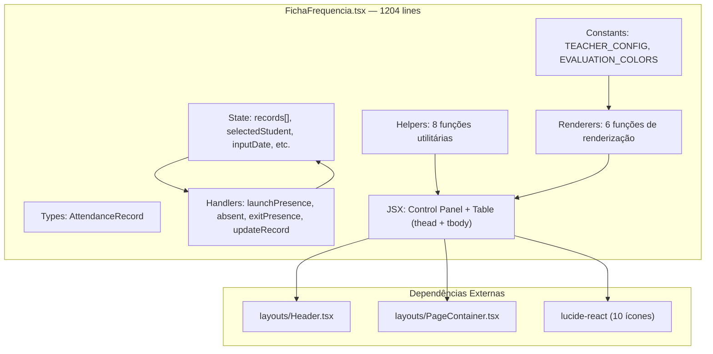

# 📋 Ficha de Frequência — Documentação Completa

## 1. Visão Geral

A **Ficha de Frequência** é um componente de tree-table interativo para gestão de presença e avaliações de alunos. É um componente **monolítico e auto-contido** — todos os tipos, constantes, helpers, renderers e state management estão em um único arquivo de **1204 linhas**.

**Características principais:**
- Tree-table com agrupamento por mês e semana
- Crosshair interativo (4 barras + borda de célula)
- Avaliações com badges coloridos (R/B/MB/Ó) em gradientes
- Teacher pills com avatar e cores distintas
- Painel de controles colapsável (accordion)
- Marcação de presenças, faltas e reposições
- Detecção de intervalos entre aulas (coffee badge)
- Duração total por dia (key badge)
- Tooltip de "Data Planejada" para reposições
- Feriados com fundo listrado (persiana)
- Highlight de linha com borda laranja pulsante
- Scroll-to-top button

---

## 2. Arquitetura



> **Nota:** Este componente NÃO importa `types/index.ts`, `utils/logic.ts`, nem `config/rules.ts`. Tudo é definido internamente.

---

## 3. Design System

### 3.1 Paleta de Cores

#### Avaliações (EVALUATION_COLORS)
| Nota | Significado | Cor de Fundo | Hex (70% opacity) |
|------|-------------|--------------|-----|
| `R` | Regular | Vermelho-200 | `rgba(254, 202, 202, 0.7)` |
| `B` | Bom | Amarelo-200 | `rgba(254, 240, 138, 0.7)` |
| `MB` | Muito Bom | Azul-200 | `rgba(191, 219, 254, 0.7)` |
| `Ó` | Ótimo | Verde-200 | `rgba(187, 247, 208, 0.7)` |
| ` ` | Vazio | Transparente | `transparent` |

#### Avaliações — Classes Tailwind (renderEvaluationSelect)
| Nota | Background class | Text class |
|------|-----------------|------------|
| `R` | `bg-red-200/70` | `text-red-900` |
| `B` | `bg-yellow-200/70` | `text-yellow-900` |
| `MB` | `bg-blue-200/70` | `text-blue-900` |
| `Ó` | `bg-green-200/70` | `text-green-900` |

#### Engajamento (renderEngagement)
| Nível | Background | Text |
|-------|-----------|------|
| 1 | `bg-gray-600/70` | `text-white` |
| 2 | `bg-red-200/70` | `text-red-900` |
| 3 | `bg-yellow-200/70` | `text-yellow-900` |
| 4 | `bg-blue-200/70` | `text-blue-900` |
| 5 | `bg-green-200/70` | `text-green-900` |

#### Presença (dots coloridos)
| Estado | Dot | Classe |
|--------|-----|--------|
| Presente (P) | 🟢 | `w-3 h-3 rounded-full bg-green-500` |
| Presente + Reposição | 🟢🟡 | Green + `bg-yellow-400` |
| Falta (F) | 🔴 | `w-3 h-3 rounded-full bg-red-500` |
| Feriado (X) | ⚪ | `w-3 h-3 rounded-full bg-slate-300` |

#### Teacher Pills (TEACHER_CONFIG)
| Professor | Cor | Iniciais | Classe Tailwind |
|-----------|-----|----------|-----------------|
| Vitor | Azul | VI | `bg-blue-600` |
| Williams | Verde | WI | `bg-emerald-600` |
| Maria C. | Rosa | MC | `bg-pink-500` |

#### Situação da Tarefa (renderTaskStatus)
| Estado | Badge | Classe |
|--------|-------|--------|
| Atrasado | **A** vermelho | `font-bold text-red-600 bg-red-100/50` no circle |
| Em dia | **E** azul | `font-bold text-blue-600 bg-blue-100/50` no circle |
| Vazio | — | Nenhum badge |

#### Check/Alert Indicators (renderCheckAlert)
| Estado | Ícone | Classe |
|--------|-------|--------|
| Atenção | ⚠️ triângulo | `AlertTriangle text-amber-500 fill-amber-100` |
| Ok (Checking Sentences) | 🟢 dot | `w-1.5 h-1.5 rounded-full bg-green-400` |
| Ok (App) | 🔵 dot | `w-1.5 h-1.5 rounded-full bg-blue-400` |

#### Backgrounds Especiais
| Tipo | Classe Tailwind | Efeito Visual |
|------|-----------------|---------------|
| Falta (hatched) | `bg-[linear-gradient(45deg,rgba(239,68,68,0.15)...)]` | Listras diagonais vermelhas 45° |
| Semana vazia (light hatched) | `bg-[linear-gradient(-45deg,rgba(56,103,214,0.1)...)]` | Listras diagonais azuis -45° |
| Feriado (holiday) | `bg-[repeating-linear-gradient(0deg,...)]` | Linhas horizontais (persiana) |
| Grupo semanal (azul) | `bg-blue-200 font-bold` | Fundo sólido azul |
| Grupo de data (rosa) | `bg-fuchsia-200 font-bold` | Fundo sólido rosa |

### 3.2 Tipografia
- **Font family:** `font-sans` (Inter)
- **Tamanho base da célula:** `text-xs` (12px)
- **Tamanho de avaliações:** `text-[10px]` (10px), `font-bold`
- **Tamanho de teacher pills:** `text-[8.5px]` (8.5px)
- **Header principal:** `text-2xl font-bold text-gray-900`
- **Labels do control panel:** `text-[10px] font-bold text-gray-500 uppercase`

### 3.3 Dimensões e Spacing

#### Constantes de Estilo (strings base)
```typescript
const cellBase = "p-1 border-r border-b border-gray-200 text-center text-xs h-8 align-middle text-gray-700 font-sans relative";
const inputBase = "w-full h-full bg-transparent text-center focus:outline-none focus:bg-blue-50 text-gray-700 disabled:text-gray-400 disabled:cursor-not-allowed font-sans";
const headerBase = "p-[3px] border-r border-b border-gray-200 font-bold bg-[#F9F5F0] text-gray-800 text-xs uppercase tracking-wider align-middle font-sans";
const subHeaderBase = "p-[3px] border-r border-b border-gray-200 font-bold bg-[#FFFDF6] text-gray-600 text-xs uppercase tracking-wider align-middle font-sans";
```

#### Larguras das Colunas
| Coluna | Largura | CSS |
|--------|---------|-----|
| Mês | auto | Sem restrição, bg azul |
| NS (Semana) | 40px | `w-10 max-w-10` |
| DS (Dia Semana) | 40px | `w-10 max-w-10` |
| D/M (Data) | 40px | `w-10 max-w-10` |
| Aula | 40px | `w-10 max-w-10` rotated |
| Comparec. | 40px | `w-10 max-w-10` rotated |
| Entrada | 80px | `w-20 min-w-20` |
| Saída | 80px | `w-20 min-w-20` |
| Lição/Conteúdo | 150px+ | `min-w-[150px]` |
| Observações | 150px+ | `min-w-[150px]` |
| F, A, L | 32px each | `w-8 min-w-8` |
| E/Trf | 56px | `w-14 min-w-14` |
| S.T, CS, APP, AL | 32px each | `w-8 min-w-8` |
| Professor(a) | 80px+ | `min-w-20` |
| Duração | 40px | `w-10 max-w-10` rotated |

---

## 4. Tipo de Dados Principal

### AttendanceRecord
```typescript
interface AttendanceRecord {
    id: string;
    month: string;              // "OUT", "NOV", "DEZ"
    weekNumber: number;         // 1-5
    dayOfWeek: string;          // "2ª", "3ª", "4ª", "5ª", "6ª", "Sáb", "Dom"
    date: string;               // "01/10", "27/11"
    fullDate: string;           // "2025-10-01" (ISO)
    classNumber: number | '';   // Número da aula (1, 2, 3...)
    presence: 'P' | 'F' | 'X'; // Presente, Falta, Feriado
    startTime: string;          // "13:00" ou "x" (falta)
    endTime: string;            // "14:00" ou "x" (falta)
    content: string;            // Lição ou conteúdo dado
    notes: string;              // Observações livres
    evaluations: {
        fala: 'R' | 'B' | 'MB' | 'Ó' | '';
        audicao: 'R' | 'B' | 'MB' | 'Ó' | '';
        leitura: 'R' | 'B' | 'MB' | 'Ó' | '';
        escrita: 'R' | 'B' | 'MB' | 'Ó' | '';
        tarefa: 'R' | 'B' | 'MB' | 'Ó' | '';
        situacaoTarefa: 'Atrasado' | 'Em dia' | '';
        checkingSentences: 'Atenção' | 'Ok' | '';
        app: 'Atenção' | 'Ok' | '';
        engajamento: number | '';   // 1-5
    };
    isMakeup?: boolean;         // Se é reposição
    teachers: string[];         // ["Vitor", "Williams"]
    isHoliday?: boolean;        // Se é feriado
    holidayName?: string;       // "CONSCIÊNCIA NEGRA"
}
```

---

## 5. Helpers — 8 Funções Utilitárias

| Função | Assinatura | Retorno | Uso |
|--------|-----------|---------|-----|
| `calculateDuration` | `(start, end) → string` | `"01:00"` | Calcula duração formatada entre dois horários |
| `calculateMinutesBetween` | `(start, end) → number` | `60` | Calcula diferença em minutos (para intervalos) |
| `getCurrentTime` | `() → string` | `"13:45"` | Hora atual formatada para launch/exit |
| `getMonthName` | `(date) → string` | `"OUT"` | Nome do mês em pt-BR (3 letras uppercase) |
| `getDayOfWeek` | `(date) → string` | `"4ª"` | Dia da semana abreviado pt-BR |
| `getFormattedDate` | `(date) → string` | `"01/10"` | Data DD/MM |
| `getFullDate` | `(date) → string` | `"2025-10-01"` | Data ISO YYYY-MM-DD |
| `getWeekOfMonth` | `(date) → number` | `3` | Número da semana no mês (1-5) |

> **Sem dependência de `date-fns`** — todos os cálculos usam `Date` nativo.

---

## 6. State Management

### Estados do Componente
| State | Tipo | Default | Uso |
|-------|------|---------|-----|
| `records` | `AttendanceRecord[]` | 20 registros mock | Dados da tabela |
| `selectedStudent` | `string` | `"Vitor"` | Aluno selecionado no dropdown |
| `inputDate` | `string` | Hoje (ISO) | Data no date picker |
| `inputClassNumber` | `string` | `""` | Número da aula no input |
| `showScrollTop` | `boolean` | `false` | Exibe botão scroll-to-top |
| `isControlPanelOpen` | `boolean` | `true` | Accordion do painel aberto/fechado |
| `highlightedRowId` | `string \| null` | `null` | ID da linha com highlight laranja |

### Refs
| Ref | Tipo | Uso |
|-----|------|-----|
| `tableContainerRef` | `HTMLDivElement` | Container da tabela (scroll, crosshair) |
| `crosshairTopRef` | `HTMLDivElement` | Barra vertical superior do crosshair |
| `crosshairBottomRef` | `HTMLDivElement` | Barra vertical inferior |
| `crosshairLeftRef` | `HTMLDivElement` | Barra horizontal esquerda |
| `crosshairRightRef` | `HTMLDivElement` | Barra horizontal direita |
| `cellBorderRef` | `HTMLDivElement` | Borda preta ao redor da célula hovered |
| `cellMetrics` | `object` | Cache de métricas da célula (rowTop, colLeft, etc.) |

---

## 7. Handlers — Ações do Usuário

### 7.1 Presença
| Handler | Trigger | Comportamento |
|---------|---------|---------------|
| `handleLaunchPresence` | Botão "Veio" | Cria registro P com `startTime = getCurrentTime()`, `endTime = ""` |
| `handleAbsent` | Botão "Faltou" | Cria registro F com `startTime = ""`, `endTime = ""` |
| `handleExitPresence` | Botão "Saída" | Atualiza último registro P com `endTime = getCurrentTime()` |

### 7.2 Edição
| Handler | Trigger | Comportamento |
|---------|---------|---------------|
| `handleUpdateRecord` | Qualquer edição de campo | Atualiza `records[]` pelo ID. Suporta nested paths como `evaluations.fala` |

**Regra:** Se `record.presence === 'F'`, impede edição exceto `classNumber`.

### 7.3 Crosshair
| Handler | Trigger | Comportamento |
|---------|---------|---------------|
| `handleRowEnter` | `onMouseEnter` de `<tr>` | Calcula `rowTop`, `rowHeight`, `monthColWidth` → `updateCrosshair()` |
| `handleColEnter` | `onMouseEnter` de `<td>` | Calcula `colLeft`, `colWidth`, `tableHeight` → `updateCrosshair()` |
| `handleMouseLeave` | `onMouseLeave` do container | Esconde todos os 5 elementos de crosshair |

### 7.4 Navegação
| Handler | Trigger | Comportamento |
|---------|---------|---------------|
| `scrollToTop` | Botão ↑ | Scroll suave para topo do container |
| `handleScroll` | `onScroll` do container | Mostra/esconde botão scroll-to-top (threshold: 300px) |

### 7.5 Highlight de Linha
- Click em pill de "Data Planejada" → `setHighlightedRowId(originalRecord.id)`
- Auto-clear após 3 segundos (`setTimeout`)
- Clear ao clicar fora (`document.addEventListener('click')`)

---

## 8. Renderers — 6 Funções de Renderização

### 8.1 `renderEvaluationSelect(record, field, value)`
- **Campos:** `fala`, `audicao`, `leitura`
- **UI:** `<select>` invisível com background colorido
- **Opções:** `""`, `"R"`, `"B"`, `"MB"`, `"Ó"`
- **Tamanho:** `text-[10px] font-bold`
- **Bloqueio:** Retorna `null` se `presence === 'F'`

### 8.2 `renderMergedEvaluation(record)`
- **Campos:** `escrita` (esquerda) + `tarefa` (direita) — mesclados em UMA célula
- **UI:** Dois `<select>` invisíveis side-by-side sobre um gradiente linear
- **Gradiente:** `linear-gradient(to right, cor_escrita, cor_tarefa)`
- **Display:** `"MB / Ó"` com separador `/`
- **Interação:** Metade esquerda edita escrita, metade direita edita tarefa

### 8.3 `renderTaskStatus(record)`
- **Campo:** `evaluations.situacaoTarefa`
- **UI:** Ciclo de 3 estados por click: `Em dia` → `Atrasado` → `""` → `Em dia`
- **Badges:** `A` vermelho ou `E` azul em círculo

### 8.4 `renderCheckAlert(record, field)`
- **Campos:** `checkingSentences` ou `app`
- **UI:** Ciclo de 3 estados por click: `Ok` → `Atenção` → `""` → `Ok`
- **Ícones:**
  - `Atenção` → `AlertTriangle` amarelo
  - `Ok` (Sentences) → Dot verde
  - `Ok` (App) → Dot azul

### 8.5 `renderEngagement(record)`
- **Campo:** `evaluations.engajamento`
- **UI:** `<select>` com opções 1-5
- **Cores:** Escala de cinza (1) a verde (5), conforme tabela na seção 3.1

### 8.6 `renderTeachers(record)`
- **Campo:** `record.teachers[]`
- **UI:** Pills coloridos com avatar circular
- **Anatomy de cada pill:**
```
┌─────────────────┐
│ [VI] Vitor      │  ← bg-blue-600, text-white
│  ↑      ↑       │
│ avatar  nome    │
│ w-4 h-4  8.5px  │
│ bg-white/20     │
└─────────────────┘
```

---

## 9. Crosshair — Arquitetura de 5 Elementos

O crosshair da Ficha funciona com **5 divs HTML absolutamente posicionados** no container da tabela:

```
         ┌──────┐
         │ TOP  │  crosshairTopRef (coluna acima)
         │      │
─────────┼──────┼─────────
 LEFT    │ CELL │  RIGHT    crosshairLeftRef + crosshairRightRef (linha)
─────────┼──────┼─────────
         │BOTTOM│  crosshairBottomRef (coluna abaixo)
         │      │
         └──────┘
                   cellBorderRef (borda na célula)
```

| Ref | Estilo | z-index |
|-----|--------|---------|
| `crosshairTopRef` | `bg-gray-500/5` | 10 |
| `crosshairBottomRef` | `bg-gray-500/5` | 10 |
| `crosshairLeftRef` | `bg-gray-500/5` | 10 |
| `crosshairRightRef` | `bg-gray-500/5` | 10 |
| `cellBorderRef` | `border-2 border-gray-300` | 10 |

**Performance:** O crosshair usa manipulação direta do DOM via refs (`.style.display`, `.style.left`) — sem re-render do React.

**Exclusão:** A coluna de Mês é excluída do crosshair horizontal (`monthColWidth` é subtraída).

---

## 10. Lógica de Agrupamento Visual

### 10.1 Agrupamento por Mês
- **Borda superior grossa:** `border-t-[3px] border-t-blue-900` quando `isNewMonth`
- **Coluna Mês:** Só exibe o nome no primeiro row daquele mês
- **Background da coluna Mês:** `bg-[#3867d6]/30` (azul 30%)

### 10.2 Agrupamento por Semana
- **Detecção:** `isFirstOfWeek` quando `weekNumber` muda ou `month` muda
- **Borda azul (box-shadow):** `inset 0 1px 0 0 #60a5fa`
- **Background do número:** `bg-blue-200 font-bold` na célula NS
- **Células vazias (mesma semana):** Listras `lightHatchedBg`, bordas removidas com `border-r-0 border-b-0`

### 10.3 Agrupamento por Data (Multi-aulas no mesmo dia)
- **Detecção:** `isSameDateAsPrev`, `isSameDateAsNext`, `isMultiClassDayStart`, `isMultiClassDayEnd`
- **Borda rosa (box-shadow):** `inset 0 1px 0 0 #e879f9` (fuchsia-400)
- **Background DS:** `bg-fuchsia-200 font-bold` no primeiro row do grupo
- **Bordas internas rosa:** Box-shadows compostos para top, bottom e left borders

### 10.4 Composição de Box-Shadows
A função `getWeekStyle(colIndex)` compõe múltiplos `box-shadow` inset para representar bordas de agrupamento sem afetar o layout:

```typescript
// Exemplo: célula que é início de semana E início de grupo multi-aula
shadows = [
    `inset 0 1px 0 0 ${blue}`,      // Borda de semana (top)
    `inset 0 2px 0 0 white`,         // Gap branco
    `inset 0 3px 0 0 ${pink}`,       // Borda de grupo (top)
    `inset 0 -1px 0 0 ${pink}`,      // Borda de grupo (bottom)
];
// → style: { boxShadow: "inset 0 1px 0 0 #60a5fa, inset 0 2px 0 0 white, ..." }
```

---

## 11. Micro-interações e Comportamentos Especiais

### 11.1 Coffee Badge (Intervalo entre aulas)
- **Trigger:** `isMultiClassDayStart` e `intervalMinutes > 0`
- **Visual:** Círculo com ícone `☕ Coffee` (lucide)
- **Posição:** Canto inferior-esquerdo da célula de "Saída"
- **Tooltip:** "Intervalo: 14:00 → 14:06 (6 min)" em fundo `slate-800`
- **Animação:** `hover:scale-110`, fade-in com `opacity-0 → opacity-100`

### 11.2 Key Badge (Duração total do dia)
- **Trigger:** Segunda linha de um grupo multi-aula (`isSecondRowOfGroup`)
- **Visual:** Círculo com ícone `🕐 Clock` + cauda retangular ("chave")
- **Posição:** Canto superior-esquerdo da célula de "Duração"
- **Tooltip à esquerda:** "Tempo Total: 02:00 (120 min)"
- **Anatomia:**
```
    ┌──────┐
    │ Key  │──────┐
    │ Head │      │ Key Tail (retângulo)
    │ 🕐  │──────┘
    └──────┘
```

### 11.3 Pill de Data Planejada (Reposição)
- **Trigger:** `row.isMakeup === true` e existe `originalRecord` com `presence === 'F'`
- **Visual:** Data envolvidda em pill com borda `border-gray-400/50`
- **Click:** Destaca a linha original da falta com borda laranja pulsante
- **Active state:** `border-orange-500 ring-1 shadow animate-pulse`
- **Tooltip:** "Data Planejada: 20/10" em fundo `slate-800`

### 11.4 Feriado Row
- **Detecção:** `row.isHoliday === true`
- **Rendering:** Row especial com:
  - Background `holidayBg` (linhas horizontais tipo persiana)
  - Bordas `border-t border-b border-gray-400` + `border-l border-l-gray-400`
  - Texto centralizado: `"FERIADO NACIONAL: {holidayName}"`
  - Colunas de avaliação/professor vazias

### 11.5 Row Highlight (Blink)
- **Trigger:** `highlightedRowId === row.id`
- **Estilo:** `box-shadow: inset 0 4px 0 0 rgba(249, 115, 22, 0.65)` (top + bottom)
- **Bordas laterais:** Apenas na primeira (col 1, left) e última coluna (col 19, right)
- **Auto-clear:** 3 segundos ou click fora
- **Escopo:** Aplicado via `getWeekStyle()` e `getHighlightStyle()`

### 11.6 Scroll-to-Top
- **Trigger:** `scrollTop > 300`
- **UI:** Botão flutuante `bottom-6 right-8 bg-blue-600 rounded-full p-3 z-50`
- **Ícone:** `ArrowUp` do lucide
- **Ação:** `scrollTo({ top: 0, behavior: 'smooth' })`

---

## 12. Painel de Controles (Accordion)

```
┌──────────────────────────────────────────────────────────────────┐
│ 📅 CONTROLES DE FREQUÊNCIA                              ▲ / ▼  │
├──────────────────────────────────────────────────────────────────┤
│                                                                  │
│ ALUNO (A):          DATA:            AULA:                       │
│ ┌─────────────┐   ┌───────────┐    ┌────┐                       │
│ │ Vitor     ▾ │   │ 21/03/2026│    │ #  │                       │
│ └─────────────┘   └───────────┘    └────┘                       │
│                                                                  │
│ ┌──────┐ ┌────────┐ ┌────────┐   Professor(a): Vitor            │
│ │ Veio │ │ Faltou │ │ Saída  │   Livro/Estágio: NEXT GENERATION │
│ └──────┘ └────────┘ └────────┘   Idioma: ENGLISH                │
│                                   Situação: [ATIVO]              │
└──────────────────────────────────────────────────────────────────┘
```

| Elemento | Classe | Detalhes |
|----------|--------|----------|
| Container | `bg-[#F9F8F6] border-b shadow-sm` | Fundo bege |
| Toggle button | `bg-gray-50 hover:bg-gray-100` | Texto uppercase tracking-wider |
| Veio | `bg-green-600 hover:bg-green-500` | Verde, disabled se `!inputClassNumber` |
| Faltou | `bg-red-600 hover:bg-red-500` | Vermelho, disabled se `!inputClassNumber` |
| Saída | `bg-slate-700 hover:bg-slate-600` | Cinza escuro, border `border-slate-600` |
| Badge ATIVO | `bg-green-600 text-white px-1 rounded text-[10px]` | Verde com texto branco |

---

## 13. Estrutura da Tabela — Header com 2 Rows

### Row 1 (Headers Principais)
| Header | colspan | rowspan | Background |
|--------|---------|---------|------------|
| DATAS | 4 | — | `#F9F5F0` |
| Aula | — | 2 | `#F9F5F0`, texto rotacionado -90° |
| Comparec. | — | 2 | `#F9F5F0`, texto rotacionado -90° |
| HORÁRIO | 2 | — | `#F9F5F0` |
| Lição/Conteúdo | — | 2 | `#F9F5F0` |
| Observações | — | 2 | `#F9F5F0` |
| AVALIAÇÕES | 8 | — | `#F9F5F0` |
| Professor(a) | — | 2 | `#F9F5F0` |
| Duração | — | 2 | `#F9F5F0`, texto rotacionado -90° |

### Row 2 (Sub-headers)
| Sub-header | Background | Cor do Texto |
|------------|-----------|-------------|
| MÊS | `#3867d6/50` | `text-blue-900` |
| NS | `#FFFDF6` | `text-gray-600` |
| DS | `#FFFDF6` | `text-gray-600` |
| D/M | `#FFFDF6` | `text-gray-600` |
| Entrada | `#FFFDF6` | `text-blue-600` (com ícones ← 👤) |
| Saída | `#FFFDF6` | `text-orange-600` (com ícones 👤 →) |
| F, A, L, E/Trf, S.T, CS, APP, AL | `#FFFDF6` | `text-gray-600` |

---

## 14. Dependências

### NPM
| Pacote | Versão | Uso |
|--------|--------|-----|
| `react` | `^19.x` | Framework UI, `useState`, `useRef`, `useEffect` |
| `lucide-react` | `^0.555.x` | 10 ícones utilizados |
| `tailwindcss` | `^4.x` | Framework CSS |

### Ícones Utilizados (lucide-react)
| Ícone | Uso |
|-------|-----|
| `FileText` | Ícone no header principal |
| `ArrowUp` | Botão scroll-to-top |
| `AlertTriangle` | Badge de atenção (avaliações) |
| `User` | Ícones de entrada/saída no sub-header |
| `ArrowLeft` | Seta de entrada |
| `ArrowRight` | Seta de saída + intervalos |
| `Coffee` | Badge de intervalo entre aulas |
| `Clock` | Badge de duração total e ícone do control panel |
| `ChevronDown` | Accordion fechado |
| `ChevronUp` | Accordion aberto |
| `Calendar` | Ícone no toggle dos controles |

---

## 15. Padrões Arquiteturais

### 15.1 Monolithic Component Pattern
Todos os tipos, constantes, helpers e renderers vivem no mesmo arquivo. Isso simplifica o transporte/isolamento mas dificulta testes unitários.

### 15.2 Ref-Based Crosshair (Mesmo padrão do Calendário)
Manipulação direta de `.style` via refs para evitar re-renders em mousemove.

### 15.3 Discriminated Row Rendering
```typescript
if (row.isHoliday) {
    return (<tr>...</tr>);  // Holiday layout
}
return (<tr>...</tr>);       // Normal layout
```

### 15.4 Composable Box-Shadow Borders
Usa arrays de `box-shadow inset` para criar bordas de agrupamento sem afetar layout:
```typescript
const shadows: string[] = [];
if (condA) shadows.push(`inset 0 1px 0 0 ${blue}`);
if (condB) shadows.push(`inset 0 -1px 0 0 ${pink}`);
return { style: { boxShadow: shadows.join(', ') } };
```

### 15.5 Cyclic Click State
Alguns campos ciclam entre 3 estados via click em vez de dropdown:
```
Click: "Em dia" → "Atrasado" → "" → "Em dia" → ...
```
