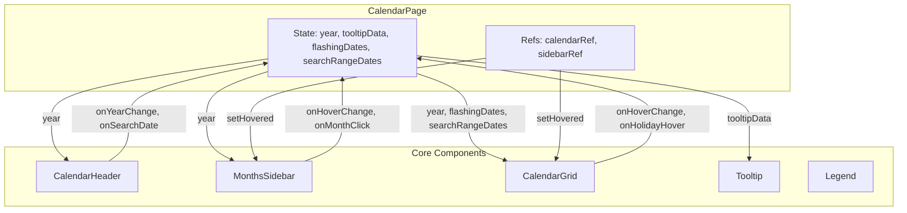

# 🗓️ Calendário Horizontal — Documentação Completa

## 1. Visão Geral

O **Calendário Horizontal** é um componente de visualização anual completo que renderiza os 12 meses do ano em uma grade SVG interativa. Cada mês ocupa uma linha horizontal com até 37 colunas (31 dias + offset de dia da semana), criando uma visualização compacta e rica em dados.

**Características principais:**
- Grid SVG com 6 camadas de renderização
- Crosshair interativo (mira) com destaque de linha e coluna
- Seleção de intervalo de datas por drag
- Busca de datas com animação "carnival-pulse"
- Smart pills coloridos para tipos de aula
- Sidebar fixa de meses com hover sincronizado
- Highlights de feriados e finais de semana
- Destaque pulsante do dia atual

---

## 2. Arquitetura de Componentes



### Hierarquia de Componentes

| Componente | Arquivo | Linhas | Papel |
|------------|---------|--------|-------|
| `CalendarPage` | `CalendarPage.tsx` | ~140 | Orquestrador — state management, refs, handlers |
| `CalendarHeader` | `components/CalendarHeader.tsx` | 214 | UI de navegação — ano e busca |
| `MonthsSidebar` | `components/MonthsSidebar.tsx` | 150 | Sidebar fixa — meses com hover |
| `CalendarGrid` | `components/CalendarGrid.tsx` | 744 | Grid SVG — coração do componente |
| `Legend` | `components/Legend.tsx` | 92 | Legenda de cores (não wired atualmente) |
| `Tooltip` | `components/Tooltip.tsx` | 102 | Tooltip de hover para feriados |

---

## 3. Design System

### 3.1 Paleta de Cores

#### Backgrounds de Células
| Estado | Cor | Hex/Value |
|--------|-----|-----------|
| Normal (sem aula) | `gray-50` | `#f9fafb` |
| Com aulas | Branco | `#ffffff` |
| Final de semana (sem aula) | Branco 40% | `rgba(255,255,255,0.4)` |
| Feriado | `red-100` | `#fee2e2` |
| Selecionado / Range | `blue-200` | `#bfdbfe` |
| Hover | `blue-50` | Tailwind `hover:fill-blue-50` |

#### Backgrounds de Colunas de Fim de Semana
| Elemento | Cor |
|----------|-----|
| Banda vertical (Sáb+Dom) | `slate-200/50` com `border-r border-gray-300/50` |
| Borda inferior | `rounded-b-lg` (8px) |

#### Cores dos Smart Pills (FILL_COLORS — `utils/logic.ts`)
| Tipo | Cor |
|------|-----|
| `Normal` (presente) | Verde `#22c55e` |
| `Reposição` | Azul |
| `Anteposição` | Rosa |
| `Falta` | Vermelho |
| `Normal + late` | Gradiente laranja→verde |
| `Normal + differentTime` | Gradiente verde→rosa |
| `Normal + late + differentTime` | Gradiente laranja→verde→rosa |

#### Crosshair
| Elemento | Cor |
|----------|-----|
| Fundo horizontal | `gray-100/85` |
| Fundo vertical | `gray-100/85` |
| Header highlight (tip) | `blue-600` |
| Borda horizontal | `gray-400` |
| Borda vertical | `gray-400` |

#### Gradientes SVG (definidos em `<defs>`)
| ID | Cores | Uso |
|----|-------|-----|
| `grad-late` | `#f97316` → `#22c55e` | Aula com atraso |
| `grad-diff` | `#22c55e` → `#ec4899` | Horário diferente |
| `grad-both` | `#f97316` → `#22c55e` → `#ec4899` | Atraso + horário diferente |

### 3.2 Tipografia
- **Font family:** `Inter` via `font-sans` (definido em `index.css` como `--font-sans`)
- **Labels de coluna (2ª 3ª etc.):** `fontSize: 11px`, `fontWeight: bold`
  - Dia de semana: `fill: #374151` (gray-700)
  - Fim de semana: `fill: #64748b` (slate-500)
  - Hovered: `fill: #ffffff`, `fontWeight: 900`
- **Números dos dias:** `fontSize: 10px`
  - Com aulas: `#374151`
  - Sem aulas: `#9ca3af` (gray-400)
- **Meses na sidebar:** `text-sm` (14px), `font-bold`, pt-BR capitalization

### 3.3 Dimensões e Spacing
| Constante | Valor | Uso |
|-----------|-------|-----|
| `CELL_SIZE` | `34px` | Largura e altura de cada célula |
| `CELL_GAP` | `4px` | Espaço entre células |
| `MARGIN.top` | `45px` | Espaço para labels de coluna |
| `MARGIN.right` | `20px` | Margem direita |
| `MARGIN.bottom` | `20px` | Margem inferior |
| `MARGIN.left` | `10px` | Margem esquerda |
| `LOGICAL_GRID_WIDTH` | `37` | 31 dias + 6 offset máximo |
| `TOTAL_MONTHS` | `12` | Linhas no grid |
| `Cell border-radius` | `6px` (`rx={6}`) | Cantos arredondados |

### 3.4 Animações
| Animação | Trigger | Detalhes |
|----------|---------|----------|
| `carnival-pulse` | Busca de data / flash | 1.5s infinite, escala 1→1.15, borda cicla vermelho→âmbar→azul→verde |
| `animate-pulse` | Destaque do dia atual | Padrão Tailwind, borda `indigo-500` pulsante |
| Hover de célula | Mouse enter | SVG `hover:stroke-blue-500 hover:stroke-2 hover:fill-blue-50` |
| Crosshair fade | Labels de coluna | `transition-colors duration-150` |

---

## 4. Arquitetura de Renderização — 6 Camadas

O `CalendarGrid` usa uma arquitetura de renderização em camadas (z-stacking) que combina elementos HTML e SVG:

```
┌─────────────────────────────────────────────┐
│ Layer 6: Flash Overlay (HTML, z-50)         │ ← animate-carnival divs
├─────────────────────────────────────────────┤
│ Layer 5: Crosshair Borders (HTML, z-20)     │ ← hBorderRef, vBorderRef
├─────────────────────────────────────────────┤
│ Layer 4: Day Cells (SVG, z-10)              │ ← rect + text + smart pills
├─────────────────────────────────────────────┤
│ Layer 3: Column Labels (SVG, z-10)          │ ← text labels 2ª 3ª 4ª...
├─────────────────────────────────────────────┤
│ Layer 2: Crosshair Backgrounds (HTML)       │ ← hBgRef, vBgRef, headerHighlightRef
├─────────────────────────────────────────────┤
│ Layer 1: Weekend Backgrounds (HTML)         │ ← bg-slate-200/50 bands
└─────────────────────────────────────────────┘
```

### Layer 1: Weekend Backgrounds
- **Tipo:** HTML `<div>` absoluto
- **Lógica:** Loop de 0 a `LOGICAL_GRID_WIDTH`, detecta `c % 7 === 5` (sábado)
- **Estilo:** `bg-slate-200/50 border-r border-gray-300/50 rounded-b-lg`
- **Dimensões:** Largura = `(CELL_SIZE + CELL_GAP) * 2` (cobre Sáb + Dom)
- **Altura:** Todo o grid vertical + margem superior

### Layer 2: Crosshair Backgrounds
- **Tipo:** HTML `<div>` com refs diretas (`hBgRef`, `vBgRef`, `headerHighlightRef`)
- **Manipulação:** `Object.assign(ref.style, ...)` — manipulação direta do DOM para performance
- **Horizontal:** `bg-gray-100/85 rounded-r-md` — banda completa da linha
- **Vertical:** `bg-gray-100/85 rounded-md` — banda completa da coluna
- **Header tip:** `bg-blue-600 rounded-t-md` — 23px de altura, destaca label da coluna

### Layer 3: Column Labels
- **Tipo:** SVG `<text>` elements
- **Labels:** `["2ª", "3ª", "4ª", "5ª", "6ª", "Sáb", "Dom"]` repetidos
- **Separador:** SVG `<line>` pontilhada (`strokeDasharray: "3,3"`) em y=-5
- **Hover:** Troca fill para branco e fontWeight para 900 via `document.getElementById`

### Layer 4: Day Cells
- **Tipo:** SVG `<g>` groups com `<rect>` + `<text>` + smart pills
- **Dados:** `gridData` memoizado com `useMemo`, recalculado quando `year`, `data`, `holidays` mudam
- **Cell background:** Variável conforme estado (normal/weekend/holiday/selected)
- **Smart pills:** `<rect>` com gradientes SVG, posicionados no bottom da célula
- **Today:** `<rect>` overlay com `stroke: #6366f1` (indigo) e `animate-pulse`

### Layer 5: Crosshair Borders
- **Tipo:** HTML `<div>` com refs (`hBorderRef`, `vBorderRef`)
- **Estilo:** `border border-gray-400` — sem fill, só borda
- **z-index:** 20

### Layer 6: Flash Overlay
- **Tipo:** HTML `<div>` com classe `animate-carnival`
- **Trigger:** Quando `flashingDates` contém a data da célula
- **Animação:** `carnival-pulse` de `calendar.css` — borda multicolorida pulsante
- **z-index:** 50

---

## 5. Componentes Atômicos

### 5.1 CalendarGrid (`744 linhas`)

#### Props Interface
```typescript
interface CalendarGridProps {
    data: CalendarEvent[];           // Eventos/aulas para exibir
    year: number;                    // Ano atual
    holidays: Holiday[];             // Lista de feriados
    onCellClick: (data, pos) => void; // Callback de clique na célula
    showSundays: boolean;            // Toggle de domingos
    onHoverChange: (data) => void;    // Callback de hover
    flashingDates: Set<string>;      // Datas para animação carnival
    searchRangeDates: Set<string>;   // Datas de range selecionado
    onClearSelection: () => void;     // Limpar seleção
    onHolidayHover: (data, pos) => void; // Hover em feriado
    onHolidayLeave: () => void;       // Sair do hover de feriado
}
```

#### Imperative Handle (forwardRef)
```typescript
interface CalendarGridHandle {
    setHovered: (monthIndex: number | null, columnIndex: number | null) => void;
}
```
Expõe `setHovered()` para que o `CalendarPage` e o `MonthsSidebar` possam controlar o crosshair diretamente via ref, sem causar re-render.

#### Tipo DayData (discriminated union)
```typescript
type DayData =
    | { type: 'valid'; dayNum; dateStr; dayEvents; holiday; x; y; colIndex; mIndex; isToday; }
    | { type: 'empty'; x; y; mIndex; colIndex; }
```

#### Memoização e Performance
| Hook | Dependências | O que faz |
|------|-------------|-----------|
| `useMemo(gridWidth, totalHeight)` | `showSundays` | Calcula dimensões totais do SVG |
| `useCallback(getVisualX)` | `showSundays` | Converte colIndex para posição X em pixels |
| `useCallback(updateCrosshair)` | `gridWidth, barHeight, getVisualX` | Manipulação direta do DOM para crosshair |
| `useMemo(gridData)` | `year, data, holidays, getVisualX` | Pré-computa todos os dados de cada célula |
| `useMemo(selectedDates)` | `selectionStart, selectionEnd` | Calcula set de datas selecionadas |
| `React.memo(CalendarGrid)` | — | Evita re-render desnecessário do componente |

#### Interações
| Interação | Trigger | Comportamento |
|-----------|---------|---------------|
| **Hover em célula** | `onMouseEnter` | Atualiza crosshair via refs + notifica CalendarPage |
| **Hover em label de coluna** | `onMouseEnter` do `<text>` | Mesma lógica de crosshair, `monthIndex: -1` |
| **Mouse leave do grid** | `onMouseLeave` do container | Esconde crosshair, notifica null |
| **Click em célula com aulas** | `onClick` | Abre tooltip com detalhes do evento |
| **Hover em feriado** | `onMouseEnter` se `holiday && !hasClasses` | Exibe tooltip com nome do feriado |
| **Drag para selecionar range** | `onMouseDown` + `onMouseEnter` em drag | `selectionStart` + `selectionEnd` → set de datas |
| **Click fora do grid** | `mousedown` global | Limpa seleção |
| **Seleção única timeout** | `useEffect` | Auto-limpa após `IMMUTABLE_RULES.interaction.singleSelectionTimeout` |
| **Scroll to flash** | `useEffect` quando `flashingDates` muda | Scroll suave para centralizar a célula buscada |

#### Smart Pills — Lógica de Gradientes
```
Dentro de cada célula com aulas, no bottom (y = CELL_SIZE - 7):
├── Normal classes (attended) → FILL_COLORS.Normal (verde)
│   ├── + late → grad-late (laranja→verde)
│   ├── + differentTime → grad-diff (verde→rosa)
│   └── + late + differentTime → grad-both (laranja→verde→rosa)
└── Other classes (Reposição, Anteposição, etc.)
    ├── Attended → + stroke verde (#15803d)
    └── FILL_COLORS[type] para cor do tipo
```

### 5.2 CalendarHeader (`214 linhas`)

#### Props
```typescript
interface CalendarHeaderProps {
    year: number;
    onYearChange: (year: number) => void;
    onSearchDate: (result: { flashingDates: string[], rangeDates: string[] }) => void;
}
```

#### Estrutura Visual
```
┌─────────────────────────────────────────────────────┐
│ 📅  Calendário Anual                                │
│ ┌─────────────────┐                ┌───────────────┐│
│ │ ◁    2025    ▷  │                │ 🔍 Buscar...  ││
│ └─────────────────┘                └───────────────┘│
└─────────────────────────────────────────────────────┘
```

#### Parser de Busca
O campo de busca aceita múltiplos formatos:
| Input | Formato Detectado | Resultado |
|-------|-------------------|-----------|
| `27/11` | Dia/Mês | Flash na data `{year}-11-27` |
| `01/05-05/05` | Range DD/MM-DD/MM | Range de datas |
| `2025-03-15` | ISO YYYY-MM-DD | Flash na data |

#### Dependências
- `date-fns`: `parse`, `isValid`, `isAfter`, `isBefore`, `format`
- `lucide-react`: `Calendar`, `ChevronLeft`, `ChevronRight`, `Search`
- `layouts/Header.tsx`

### 5.3 MonthsSidebar (`150 linhas`)

#### Props
```typescript
interface MonthsSidebarProps {
    year: number;
    onHoverChange: (data: { monthIndex: number | null; columnIndex: number | null } | null) => void;
    onMonthClick: (monthIndex: number) => void;
}

interface MonthsSidebarHandle {
    setHovered: (monthIndex: number | null) => void;
}
```

#### Estrutura Visual
```
┌──────────┐
│  Janeiro  │ ← Hover: bg-slate-100, text-blue-600
│ Fevereiro │
│   Março   │
│   Abril   │
│   Maio    │ ← Hovered: font-bold, shadow-inner
│   Junho   │
│   Julho   │
│  Agosto   │
│ Setembro  │
│  Outubro  │
│ Novembro  │
│ Dezembro  │
└──────────┘
```

#### Comportamentos
- **Hover em mês:** Notifica `onHoverChange({ monthIndex, columnIndex: null })`
- **Click em mês:** Notifica `onMonthClick(monthIndex)`
- **Recebe `setHovered(monthIndex)` via ref** para sincronizar com hover do CalendarGrid

### 5.4 Tooltip (`102 linhas`)

#### Props
```typescript
interface CalendarTooltipProps {
    data: { event: CalendarEvent; holiday?: Holiday } | null;
    position: { x: number; y: number };
    visible: boolean;
}
```

#### Renderização
- Holiday: nome em vermelho (`text-red-600`), tipo em cinza
- Event: nome do evento, horário, tipo
- Arrow: triângulo CSS na base (`border` trick)
- Posicionamento: `fixed z-50 transform -translate-y-full -translate-x-1/2 -mt-2`

### 5.5 Legend (`92 linhas`)

#### Elementos
- Lista de todas as cores de smart pills com labels
- Toggle de exibição de domingos (`showSundays`)
- Botão "Recalcular"

> **Nota:** Este componente existe no código mas **não está wired** no layout atual.

---

## 6. Tipos de Dados

### CalendarEvent (`types/index.ts`)
```typescript
interface CalendarEvent {
    date: string;        // "YYYY-MM-DD"
    type: string;        // "Normal", "Reposição", "Anteposição"
    attended: boolean;   // Se o aluno compareceu
    late?: boolean;      // Se chegou atrasado
    differentTime?: boolean; // Se foi em horário diferente
}
```

### Holiday (`types/index.ts`)
```typescript
interface Holiday {
    date: string;  // "YYYY-MM-DD"
    name: string;  // "Carnaval", "Natal", etc.
    type: string;  // "Nacional", "Estadual", "Municipal"
}
```

### DaySchedule (`types/index.ts`)
```typescript
interface DaySchedule {
    date: string;
    startTime: string;
    endTime: string;
    available: boolean;
}
```

---

## 7. Configuração (`config/rules.ts`)

### IMMUTABLE_RULES
```typescript
const IMMUTABLE_RULES = {
    holidays: HolidayRule[],        // Feriados nacionais 2025
    recessPeriods: RecessRule[],     // Períodos de recesso
    attendance: { ... },            // Regras de frequência
    interaction: {
        singleSelectionTimeout: 5000  // 5s para auto-limpar seleção única
    }
};
```

### Feriados Configurados (2025)
| Data | Nome | Tipo |
|------|------|------|
| 2025-01-01 | Confraternização Universal | Nacional |
| 2025-03-04 | Carnaval | Nacional |
| 2025-04-18 | Sexta-feira Santa | Nacional |
| 2025-04-21 | Tiradentes | Nacional |
| 2025-05-01 | Dia do Trabalho | Nacional |
| 2025-06-19 | Corpus Christi | Nacional |
| 2025-09-07 | Independência do Brasil | Nacional |
| 2025-10-12 | N.S. Aparecida | Nacional |
| 2025-11-02 | Finados | Nacional |
| 2025-11-15 | Proclamação da República | Nacional |
| 2025-11-20 | Consciência Negra | Nacional |
| 2025-12-25 | Natal | Nacional |

### Função `isNonClassDay(dateStr)`
Retorna `true` se a data é feriado, recesso, ou cai em domingo (usado para lógica de contagem de aulas).

---

## 8. Utilitários (`utils/logic.ts`)

### FILL_COLORS
```typescript
const FILL_COLORS: Record<string, string> = {
    Normal: "#22c55e",      // Verde
    Reposição: "#3b82f6",   // Azul
    Anteposição: "#ec4899", // Rosa
    Falta: "#ef4444",       // Vermelho
    // ...outros tipos
};
```

### WEEK_DAYS
```typescript
const WEEK_DAYS = ["2ª", "3ª", "4ª", "5ª", "6ª", "Sáb", "Dom"];
```

### KPI Interface
```typescript
interface KPI {
    label: string;
    value: number;
    unit?: string;
}
```

---

## 9. Padrões Arquiteturais

### 9.1 Performance Pattern — "Ref-Based Crosshair"
O crosshair NÃO usa state do React. Utiliza `useRef` + `Object.assign(ref.style)` para manipulação direta do DOM, evitando re-renders do componente de 744 linhas a cada movimento do mouse.

```
Mouse Move → updateCrosshair(monthIndex, colIndex)
           → Object.assign(hBgRef.current.style, {...})  ← DOM direto
           → Object.assign(vBgRef.current.style, {...})  ← DOM direto
           → document.getElementById('col-label-N').setAttribute(...)  ← DOM direto
```

### 9.2 Communication Pattern — "Ref-Based Inter-Component"
CalendarGrid e MonthsSidebar se comunicam via `forwardRef` + `useImperativeHandle`, sem subir state para o parent:

```
CalendarGrid hover → onHoverChange(data) → CalendarPage
CalendarPage → sidebarRef.current.setHovered(monthIndex)  ← ref direto
CalendarPage → calendarRef.current.setHovered(m, c)        ← ref direto
```

### 9.3 Data Computation Pattern — "Memoized Grid Data"
`gridData` é computado uma vez com `useMemo` e contém TODOS os dados pré-calculados (posições x/y, eventos, feriados, isToday) para evitar recálculos durante o render.

### 9.4 Layer Composition Pattern — "HTML + SVG Compositing"
O grid combina HTML divs (camadas 1, 2, 5, 6) com SVG (camadas 3, 4) usando z-index e positioning absoluto. Isso permite usar CSS transitions em HTML e SVG optimizations para renderizar centenas de células.

---

## 10. Dependências NPM

| Pacote | Versão | Uso |
|--------|--------|-----|
| `react` | `^19.x` | Framework UI |
| `date-fns` | `^4.x` | `format`, `getDaysInMonth`, `addMonths`, `parse`, `isValid`, `isAfter`, `isBefore` |
| `lucide-react` | `^0.555.x` | Ícones (`Calendar`, `ChevronLeft`, `ChevronRight`, `Search`) |
| `tailwindcss` | `^4.x` | Framework CSS (v4 com `@import "tailwindcss"`) |

---

## 11. Fluxo de Dados Completo

```
Usuário digita "27/11" no campo de busca
  ↓
CalendarHeader.parseSearchInput("27/11")
  ↓ { flashingDates: ["2025-11-27"], rangeDates: [] }
CalendarPage.handleSearchDate(result)
  ↓ setFlashingDates(new Set(["2025-11-27"]))
CalendarGrid re-renders
  ↓ Layer 6 cria div com animate-carnival sobre a célula 27/nov
  ↓ useEffect detecta flashingDates mudou → scroll suave para célula
  ↓ setTimeout(2000ms) → limpa flashingDates
```
